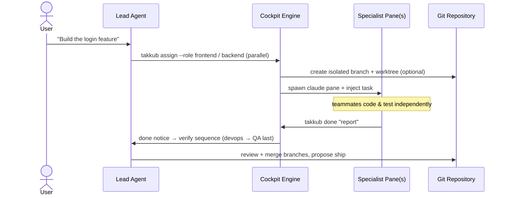

# 🛩️ agent-takkub

**A local-first desktop cockpit for orchestrating a team of Claude Code agents in one unified window.**

[](https://www.npmjs.com/package/agent-takkub)
[](https://github.com/takkub/agent-takkub/blob/main/LICENSE)
[](https://github.com/takkub/agent-takkub)
[](https://www.python.org/)
[](https://nodejs.org/)

---

## 🖥️ The Desktop Cockpit


*One window: you talk to the **Lead**, it spawns and drives specialist teammates (frontend · backend · qa · …) as live Claude Code panes.*

---

## ✨ Why agent-takkub?

A single AI agent struggles with big features: context fills up, sub-tasks conflict, and everything runs serially. `agent-takkub` uses the **Lead–Specialist pattern**: you prompt one **Lead** agent, and it delegates isolated, specialized sub-tasks to real `claude` processes running concurrently.

* **🧠 Orchestrated teammates** — converse with the Lead; it spawns, tasks, and manages specialist panes (`frontend`, `backend`, `qa`, `reviewer`, `devops`, …) on demand.
* **🔀 True parallelism** — `frontend` and `backend` build features concurrently; QA always verifies last, against the real stack.
* **🌿 Branch & worktree isolation** — parallel teammates each work on their own git branch in an isolated worktree. No commit races, no dirty-state collisions; you merge when ready.
* **👥 Fleet mode** — one toggle scales a role into a fleet (`frontend#1…#K`) sized to your machine, for independent features or sharded test suites.
* **🖥️ Steerable processes** — every pane is a live `claude` shell. Watch output in real time, interrupt, or type directly into any teammate.
* **🗂️ Multi-project tabs** — one isolated Lead per project; no cross-talk.
* **🔒 100% local** — no SaaS middleware. Runs on your machine, on your logged-in Claude Code CLI.

---

## ⚡ Quick Start

```bash
# 1. Install the cockpit globally (isolated Python runtime + Desktop icon)
npm install -g agent-takkub

# 2. Authenticate with your Claude account (if not already done)
claude login

# 3. Provision recommended plugins + browser automation tools
takkub provision
```

Then double-click **Takkub Cockpit** on your Desktop — or run:

```bash
agent-takkub
```

> **Requirements:** Node.js ≥ 18 and Python ≥ 3.11 on your system — *detected, never reinstalled.*
> Everything else lives in an isolated `~/.agent-takkub`; your existing `claude` CLI, plugins, and config are left untouched.

---

## 🔄 Orchestration Flow



---

## 🛠️ Everyday Commands

| Command | Purpose |
| :--- | :--- |
| `takkub assign --role backend "…"` | Spawn a specialist and assign a task |
| `takkub assign --role frontend --isolation worktree "…"` | Task on an isolated git branch + worktree |
| `takkub assign --role qa --plan --shards 4 "…"` | Plan-first parallel browser QA (auto fan-out) |
| `takkub worktree list / merge / clean` | Review + merge isolated branches |
| `takkub send --to qa "…"` | Message a teammate (Lead CC’d) |
| `takkub goal "…"` | Set a session goal injected into every task |
| `takkub restart` | Restart the whole cockpit from the terminal |
| `takkub doctor --fix` | Diagnose the environment + auto-repair |
| `takkub provision` | Install / repair plugins + browser tools |

---

## 📖 Deep Dives & Resources

- 🏗️ **Architecture & design** — [Architecture Guide](https://github.com/takkub/agent-takkub/blob/main/docs/ARCHITECTURE.md)
- ⚙️ **System overview & flow diagrams** — [docs/system-overview](https://github.com/takkub/agent-takkub/tree/main/docs/system-overview)
- 🔧 **From source / one-shot installer** (Chrome, gh, codex, rtk, …) — [INSTALL.md](https://github.com/takkub/agent-takkub/blob/main/docs/INSTALL.md)
- 🐙 **GitHub** — [takkub/agent-takkub](https://github.com/takkub/agent-takkub)

---

<div align="center">
  <sub>Windows & macOS • built on PyQt6 • powered by the Claude Code CLI • MIT</sub>
</div>
