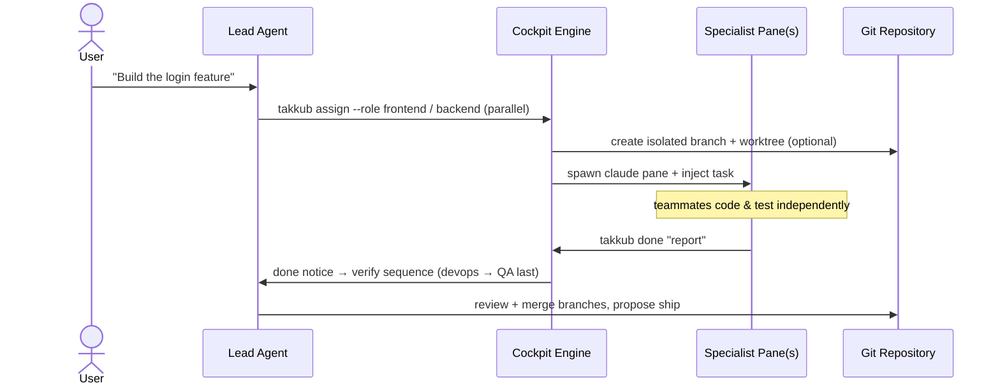

<div align="center">

# 🛩️ agent-takkub

### Your AI dev team — in one desktop cockpit.

**Prompt one _Lead_ agent. It plans the work, splits it across specialist teammates, runs them in parallel as real `claude` processes, and verifies the result — while you watch and steer.**

[](https://www.npmjs.com/package/agent-takkub)
[](https://www.npmjs.com/package/agent-takkub)
[](https://github.com/takkub/agent-takkub/blob/main/LICENSE)
[](https://github.com/takkub/agent-takkub)

```bash
npm install -g agent-takkub
```

<sub>100% local · runs on **your** logged-in Claude Code CLI · no SaaS middleware</sub>

</div>

---

## 🖥️ The Desktop Cockpit


<div align="center"><i>One window: you talk to the <b>Lead</b>, and it spawns and drives specialist teammates (frontend · backend · qa · reviewer · devops · …) as live Claude Code panes.</i></div>

---

## ✨ Why agent-takkub?

A single AI agent hits a wall on big work: context fills up, sub-tasks collide, and everything runs one-at-a-time. `agent-takkub` runs it like a **real engineering team** — a **Lead** you talk to, and specialist teammates it delegates to, each in its own isolated `claude` process, working **concurrently**.

|  |  |
| :-- | :-- |
| 🧠 **Orchestrated teammates** | Converse with the Lead; it spawns, tasks, and manages specialist panes (`frontend`, `backend`, `qa`, `reviewer`, `devops`, `mobile`, …) on demand — only the roles a job actually needs. |
| 🔀 **True parallelism** | `frontend` and `backend` build a feature at the same time; QA always verifies **last**, against the real running stack. |
| 🌿 **Branch & worktree isolation** | Parallel teammates each work on their own git branch in an isolated worktree — no commit races, no dirty-state collisions. You merge when ready. |
| 👥 **Fleet mode** | One toggle scales a role into a fleet (`frontend#1…#K`) sized to your machine — for many independent features or sharded test suites at once. |
| 🖥️ **Steerable, always** | Every pane is a live `claude` shell. Watch output in real time, interrupt, or type straight into any teammate. |
| 🗂️ **Multi-project tabs** | One isolated Lead per project — no cross-talk. |
| 🔒 **100% local** | No SaaS middleware. Everything runs on your machine, on your logged-in Claude Code CLI. |

---

## 🧠 One team, three model "brains"

Model diversity beats a single point of view. Takkub lets the Lead pull in a **second and third brain** for planning, review, and cross-checks — and it never breaks if you don't have them installed.

| Brain | Backed by | Great at |
| :-- | :-- | :-- |
| 🟣 **Claude** | Claude Code CLI | The Lead + every specialist — build, test, review |
| 🟢 **Codex** | OpenAI Codex CLI | Second opinion · refactor patterns · cross-checking a plan |
| 🔵 **Gemini** | Google Antigravity (`agy`) | Long-context planning (reads the whole repo) · a third perspective |

> **Never a hard dependency.** If Codex or Gemini isn't installed (or you've toggled it off), the Lead keeps the role — **Claude transparently stands in**, and tells you you've traded away model diversity. No refusals, no dead ends.

---

## ⚡ Quick Start

```bash
# 1. Install the cockpit globally  (isolated Python runtime + a Desktop icon)
npm install -g agent-takkub

# 2. Authenticate with your Claude account (if you haven't already)
claude login

# 3. Provision recommended plugins + browser-automation tools (idempotent)
takkub provision
```

> ⚠️ **Install it globally — the `-g` flag matters.** It provisions the isolated runtime and the Desktop launcher. A plain `npm install agent-takkub` (no `-g`) will **not** set the app up.

Then **double-click “Takkub Cockpit”** on your Desktop — or launch from a terminal:

```bash
agent-takkub
```

<table>
<tr><td>

**Requirements** — Node.js ≥ 18 and Python ≥ 3.11 already on your system. They're **detected, never reinstalled**. Everything else lives in an isolated `~/.agent-takkub`; your existing `claude` CLI, plugins, and config are left completely untouched.

</td></tr>
</table>

---

## 🚦 Two ways to run: 1:1 or a whole team

A chip in the status bar flips how the Lead works:

- **👤 1:1 (default)** — one agent per role, one feature at a time. Focused and predictable.
- **👥 Multi** — hand the Lead several independent features and it **fans out** into multiple instances per role (`frontend#1…#K`, `backend#1…#K`) running at once, like a team of several devs per position. Finishes fast.

Dependent work stays sequential automatically; **QA is always the final gate**, run against the real stack.

---

## 🔄 Orchestration Flow



---

## 📱 Mobile Remote Control (PWA)

<p align="center">
  
</p>

<div align="center"><i>Step away from the desk — pair your phone once (link / QR) and watch <b>and steer</b> the Lead from anywhere, through an install-free PWA.</i></div>

- **📲 Install-free PWA** — open the paired link, *Add to Home Screen*, done. Offline-capable app shell, no store.
- **💬 Live Lead console** — the Lead's replies stream to your phone in real time (with a "still working…" indicator); type back to steer it.
- **📊 Pulse** — a glanceable, project-grouped view of which teammates are running and for how long.
- **🎛️ View vs. control** — read-only by default; flip to control mode to send prompts or open projects remotely.
- **🔒 Three-factor, off by default** — secret path + bearer token (never in the QR) + a password gate, on a loopback-only server behind a Cloudflare/ngrok tunnel, with per-client sessions & brute-force lockout. Data-minimized: never ships raw tool output, commands, or filesystem paths. Turn it on from the cockpit's **🌐 Remote** chip.

---

## 🛠️ Everyday Commands

| Command | Purpose |
| :--- | :--- |
| `takkub assign --role backend "…"` | Spawn a specialist and assign a task |
| `takkub assign --role frontend --isolation worktree "…"` | Task on an isolated git branch + worktree |
| `takkub assign --role qa --plan --shards 4 "…"` | Plan-first parallel browser QA (auto fan-out) |
| `takkub worktree list / merge / clean` | Review + merge isolated branches |
| `takkub send --to qa "…"` | Message a teammate (Lead CC’d) |
| `takkub goal "…"` | Set a session goal injected into every task |
| `takkub restart` | Restart the whole cockpit from the terminal |
| `takkub doctor --fix` | Diagnose the environment + auto-repair |
| `takkub provision` | Install / repair plugins + browser tools |

---

## 📖 Deep Dives & Resources

- 🏗️ **Architecture & design** — [Architecture Guide](https://github.com/takkub/agent-takkub/blob/main/docs/ARCHITECTURE.md)
- ⚙️ **System overview & flow diagrams** — [docs/system-overview](https://github.com/takkub/agent-takkub/tree/main/docs/system-overview)
- 🔧 **From source / one-shot installer** (Chrome, gh, Codex, Antigravity, rtk, …) — [INSTALL.md](https://github.com/takkub/agent-takkub/blob/main/docs/INSTALL.md)
- 🐙 **GitHub** — [takkub/agent-takkub](https://github.com/takkub/agent-takkub)

---

<div align="center">
  <sub>Windows &amp; macOS • built on PyQt6 • powered by the Claude Code CLI • MIT-licensed</sub>
</div>
