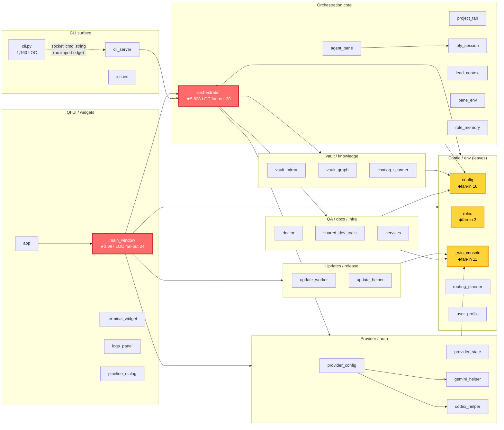

# กราฟความสัมพันธ์ไฟล์ (File-Relationship Graph) สำหรับ agent-takkub — สร้างเองหรือใช้ plugin?

> คำแนะนำสุดท้าย: **สร้าง dependency-graph doc ที่ commit ไว้ + เปิด Serena MCP + ใส่ import-linter** — ไม่ใช่ GraphRAG ตัวหนัก ตัวเลือกนี้แก้ปัญหา "Claude หลงใน god-file แล้วเดา code" ได้ตรงจุด ด้วย effort ต่ำสุด

---

## 1. สรุปสภาพปัจจุบัน

ของจริงจาก codebase scan (ไม่ใช่เดา):

- **51 modules / ~25k LOC** ใน `src/agent_takkub/` — grep `from .X import` / `from agent_takkub.X import` เจอ **172 internal-import edges** ข้าม 30 importing modules (อีก 21 เป็น pure leaf)
- **God-files 3 ตัว** (เรียงตามความหนัก):
  1. `orchestrator.py` — **5,828 LOC, fan-out 20** (engine หลัก spawn/assign/route/handoff/provider-degrade)
  2. `main_window.py` — **3,997 LOC, fan-out 24** (สูงสุดในเรปอ — Qt god-object เดินสาย UI ทุก subsystem)
  3. `cli.py` — **1,160 LOC, fan-out 11** (argparse dispatch — แต่ lazy import ช่วยให้หลวมอยู่แล้ว ไม่ด่วน)
- **Hub modules (fan-in สูง — แตะแล้วกระเทือนทั้งเรปอ):**
  - `config` — fan-in **16** (universal leaf hub: paths/projects/executable discovery — **ห้ามแตก** จะ ripple ทุกที่ เก็บให้เล็กและนิ่ง)
  - `_win_console` — fan-in **11** (Windows subprocess flag — leaf จิ๋ว ปล่อยไว้)
  - `roles`, `provider_config`, `provider_state`, `agent_pane`, `vault_mirror`, `pty_session`, `gemini_helper`, `codex_helper` — fan-in 2–4
- **ไม่มี import cycle** ระดับ module (config/_win_console/roles เป็น sink) — แต่ `app→main_window→orchestrator` เป็น layered chain ที่ยาว

### ทำไม Claude ถึงหลง — มันไม่ใช่แค่ import graph

import graph ธรรมดา **ไม่พอ** เพราะ edge สำคัญที่สุดของเรปอนี้ **ซ่อนอยู่ใน string/call ไม่ใช่ใน import**:

| ปัญหาที่ทำ Claude เดา | edge อยู่ที่ไหน | import graph เห็นไหม |
|---|---|---|
| **IPC string-dispatch** `takkub assign` → socket → `cli_server` `cmd=='assign'` → `orch.assign()` | literal string `'assign'` คนละฝั่ง socket | ❌ **zero import edge** — "assign รันที่ไหน" ตอบจาก import ไม่ได้เลย |
| **Re-export façade** — `orchestrator` re-export ~30 symbol จาก `lead_context`/`pane_env`/`vault_mirror` ให้ test/doctor | definition อยู่คนละไฟล์กับ import-site | ❌ import ชี้ผิดทาง (เห็น orchestrator เป็นเจ้าของ แต่นิยามจริงอยู่ที่อื่น) |
| **Late/lazy import** ~60+ deps ใน def body (กัน cycle + lazy-load Qt) | ข้างใน function | ⚠️ top-of-file graph **นับ fan-out ต่ำกว่าจริง** — main_window แสดง 13 แต่จริง 25+ |
| **String-keyed role tables** — `'critic'/'designer'/'gemini'` ซ้ำใน ≥5 ตาราง ไม่มี shared enum | bare string ใน roles/shared_dev_tools/provider_config/routing_planner/37 literals ใน orchestrator | ❌ ต้อง grep string ยังเสี่ยงพลาดตาราง |
| **Prompt↔code drift** — CLAUDE.md routing table vs `routing_planner` regex; `pty_session` ready-detect ผูก vendor string | English prose / external CLI footer | ❌ ไม่ใช่ code edge เลย |
| **Duplicated logic** — `--since` parser ซ้ำ 2 ที่ใน cli_server; `_split_shard` ถูกเรียก 3 ทาง | copy-paste | ❌ ต้องใช้ clone detector |

**สรุป:** ปัญหา 2 ชั้น — (1) god-file ใหญ่เกินอ่าน Claude เลย grep มั่ว, (2) edge จริงครึ่งหนึ่งเป็น string/call ที่ import graph มองไม่เห็น เครื่องมือที่เลือกต้องตอบทั้ง 2 ชั้น

---

## 2. กราฟความสัมพันธ์จริง (ตอนนี้)

Render จาก import adjacency จริง จัดกลุ่มตาม architecture cluster — แสดง **cluster-level edges + hub modules** (ไม่ลากทั้ง 172 เส้น เพื่อให้อ่านออก) จุดเน้นคือ **orchestrator + main_window (god-file)** และ **config (leaf hub fan-in 16)**



**อ่านกราฟ:** สีแดง = god-file (แตะแล้ว ripple เพราะ fan-out สูง — Claude หลงตรงนี้) · สีเหลือง = leaf hub (fan-in สูง — **อย่าแตก** แค่เก็บให้นิ่ง) · เส้นประ `cli ⇢ cli_server` = **IPC string boundary ที่ไม่มี import edge** — นี่คือจุดที่ import graph อย่างเดียวตอบไม่ได้

---

## 3. ตัวเลือกเครื่องมือ (จัดอันดับเป็น TIER)

วิจัย + verify จริงแล้ว จัด 3 tier ตาม effort/payoff:

### 🟢 Tier 1 — Lightweight native (floor เสมอ, สร้างเอง, no infra)

**A. Committed dependency-graph doc + CLAUDE.md pointer**
- **ทำอะไร:** generate module dep-graph ครั้งเดียว (ด้วย `grimp` หรือ `/graphify`) → commit ที่ `docs/architecture/depgraph.json` + เขียน god-file map มือ (orchestrator/main_window แต่ละตัว own อะไร, public seam อยู่ไหน) → ชี้ใน CLAUDE.md ว่า "อ่านก่อน navigate"
- **กันเดายังไง:** CLAUDE.md auto-load → turn แรก Claude เห็น layout ทันที ไม่ต้อง grep มั่ว ไม่มี MCP round-trip ไม่มี failure mode
- **Windows/Python/Claude Code:** pure repo artifact + 1 บรรทัด CLAUDE.md ทำงานเหมือนกันทุก cockpit pane zero per-pane config — **ตรงกับ pattern เรปอนี้ใช้อยู่แล้ว**
- **Effort:** ต่ำ · **Verdict (verified):** ✅ recommend — battle-tested ที่สุดของ Claude Code practice · caveat: static snapshot stale ได้ ต้องมี refresh discipline (pre-commit hook / `/graphify` rerun)

**B. import-linter (graph guardrail)**
- **ทำอะไร:** ประกาศ architecture contract ใน `pyproject.toml` (layer: `cli/main_window → orchestrator → config`; forbidden: `orchestrator` ห้าม import `main_window`) → `lint-imports` fail CI ถ้ามี edge เถื่อน
- **กันเดายังไง:** ไม่ได้ช่วย **หา** code แต่ keep graph **สะอาด** — turn architecture เป็น machine-checked truth ที่ Claude อ่านเป็น design intent + กัน god-file งอก tangle ใหม่ ทุกครั้ง refactor
- **Windows/Python:** pure-Python, prebuilt, static analysis (ไม่ exec — ปลอดภัยกับ PyQt) · **Verified:** import-linter 2.9 (2026-02), grimp 3.14 มี prebuilt Windows wheels (3.10–3.14) — pip install ผ่านเลย
- **Effort:** ต่ำ-กลาง (เขียน contract แรก ~30 นาที) · **Verdict:** ✅ recommend-with-caveats — เป็น guardrail ไม่ใช่ navigation; contract ชน violation เดิมเยอะ ต้อง whitelist/refactor ก่อน → ทำ incremental

> **หมายเหตุ grimp vs pydeps (verified):** ใช้ **grimp** (static, ไม่ exec, มี Windows wheel) **อย่าใช้ pydeps** กับเรปอ PyQt นี้ — pydeps วิเคราะห์ bytecode ต้อง import โค้ดจริง (เสี่ยง Qt GUI side-effect / ModuleNotFoundError) + ต้องลง Graphviz `dot` บน PATH + output เป็น SVG ที่ agent อ่านไม่ได้

### 🟡 Tier 2 — MCP symbol navigation (live find-symbol/references — เปิดทับ Tier 1)

**Serena (oraios/serena) — แนะนำตัวนี้**
- **ทำอะไร:** MCP server ครอบ LSP จริง (Pyright สำหรับ Python) → tool ระดับ symbol: `find_symbol`, `find_referencing_symbols`, `get_symbols_overview`, type/call hierarchy, symbol-level edit
- **กันเดายังไง — นี่คือ lever ใหญ่สุดสำหรับ god-file:** แทนที่ Claude อ่าน `orchestrator.py` 5,828 บรรทัดทั้งไฟล์ (เปลือง context แล้วเดาว่า function อยู่ไหน/ใครเรียก) → เรียก `find_symbol('Orchestrator/spawn')` ดึงเฉพาะ symbol นั้น + `find_referencing_symbols` ได้ **caller list จริงพร้อม file:line** ก่อนแก้ → เห็น blast radius จริง ไม่พัง caller ที่มองไม่เห็น Pyright resolve import/inheritance แม่น = ตอบ "ใครเรียก X / X นิยามที่ไหน" จาก language server ไม่ใช่จินตนาการ model
- **Windows/Python/Claude Code (verified จริง):** native Windows support (ไม่ใช่ WSL-only), `context claude-code` มีไว้เฉพาะ client นี้, ~25.6k stars, v1.5.3 (2026-05) ยัง active
- **Effort:** ต่ำ — 1 คำสั่ง `claude mcp add` + ลง `uv` · **Verdict (verified):** ✅ **recommend-with-caveats** — fit ตรงปัญหาที่สุด แต่ verify ตรงไปตรงมา:
  - ⚠️ Pyright เป็น Node-based → **ต้องมี Node.js + npm บน PATH** ไม่งั้น LSP ติดตั้งไม่ได้ (Windows failure mode ที่เจอบ่อยสุด)
  - ⚠️ Serena ใช้ Python env ของตัวเอง → **activate project venv ก่อน launch** ไม่งั้น resolve import ข้าม module ไม่ครบ
  - ⚠️ หา dated first-hand "Windows+Python สำเร็จ" report ไม่เจอ → **ทำ 30-min smoke test ก่อนเชื่อ** (`/mcp` ดู tool ขึ้นครบ → `get_symbols_overview` god-file → `find_referencing_symbols` 1 function — ถ้า clean = ใช้ได้)
  - ข้อจำกัด: ตอบ per-symbol (ใครเรียก THIS) **ไม่ใช่** call-graph ทั้งเรปอ — แต่ปกตินั่นคือสิ่งที่ agent ต้องการ

**ทางเลือกใน tier นี้ที่ verify แล้ว = ❌ SKIP:**
- **mcp-language-server (isaacphi) + pyright** — **SKIP** disqualifier 3 ข้อ: (a) ไม่มี call-hierarchy tool เลย, (b) Windows file-URI fix เป็น PR ค้าง unmerged → references/definition คืน "not found" บน Windows ใน build ที่ released, (c) dormant (commit จริงล่าสุด พ.ค. 2025) + pyright เป็น `.cmd` ที่ Go exec ตรงไม่ได้ (ENOENT)
- **aider RepoMap / RepoMapper** — ได้ PageRank-ranked symbol map ดี แต่เป็น solo fork stale (~6 เดือน) + มี uv.lock trap → ใช้เป็น **CLI manual** paste เข้า repo-map doc ได้ (zero-integration-risk) แต่ไม่ใช่ MCP หลัก

### 🔴 Tier 3 — Heavy (GraphRAG / graph-DB) — ❌ ไม่แนะนำสำหรับเรปอนี้

| ตัว | ทำไมไม่เอา (verified) |
|---|---|
| **Microsoft GraphRAG** | LLM-extract entity graph สำหรับ **prose corpus** ไม่ใช่ code — เรปอ Python 25k-LOC โครงสร้าง extract แบบ deterministic ได้ฟรีอยู่แล้ว ไม่ต้องจ่าย LLM token index เลย; stochastic, ไม่มี Claude Code wiring → **overkill ชัด ของ hype สำหรับ scale นี้** |
| **code-graph-rag / blarify / potpie** | ต้อง Docker + Memgraph/Neo4j/Postgres/Redis รันค้าง + re-index → infra หนักเกินสำหรับ solo Windows dev; blarify ยังไม่มี MCP server (ต้อง build glue เอง) |
| **Sourcegraph SCIP MCP** | ต้อง stand-up Sourcegraph instance + scip-python index — enterprise multi-repo ไม่ใช่ 1 local repo |

> **ของที่ "ดู hype" แต่จริง:** `graphify` (มีอยู่แล้ว) + `codebase-memory-mcp` ให้ deterministic AST graph **ฟรี** — ไม่ต้องแตะ GraphRAG ตัวหนัก star count ของ graphify (~70k ใน 2 เดือน) จริงตาม API แต่ project อายุ 2 เดือน 139 releases = format churn สูง → **treat graph.json เป็น build artifact ไม่ใช่ ground truth**

---

## 4. คำแนะนำสำหรับโปรเจคนี้ (ตัดสินใจชัด)

**เส้นทางที่แนะนำ = Tier 1 (floor เสมอ) + Tier 2 Serena (live nav) — ข้าม Tier 3**

เหตุผล: Tier 1 deterministic + commit ได้ + ทำงานทุก pane ไม่มี failure mode (แก้ชั้น "module ไหน import อะไร") · Serena แก้ชั้น "หลงใน god-file" ระดับ symbol/reference จริงด้วย Pyright · import-linter กันงอกใหม่ · ไม่ต้อง Docker/Neo4j/LLM-index

> **ใช้ของที่มีอยู่แล้ว:** เรปอมี `/graphify` skill + `vault_graph.py` + `chatlog_scanner.py` — แต่ระวัง: `vault_graph.py` เล็งที่ **Obsidian vault ไม่ใช่ Python source** จึง **reuse ตรงๆ ไม่ได้** สำหรับ code-import graph อย่างไรก็ดี `/graphify` skill ทำ tree-sitter AST graph ของ **code folder** ได้ → repurpose มาทำ code graph แล้ว export markdown-wiki เป็น `docs/architecture/depgraph.json` ได้เลย (เป็น artifact Tier 1 ตัว A)

### EXACT first steps

**Step 1 — Tier 1 dep-graph doc (สร้าง grimp script)**
```bash
# ลง tools
pip install grimp import-linter
```
สร้าง `tools/gen_import_graph.py`:
```python
import grimp, json, pathlib
g = grimp.build_graph("agent_takkub")
out = []
for m in sorted(g.modules):
    out.append({
        "module": m,
        "imports": sorted(g.find_modules_directly_imported_by(m)),
        "imported_by": sorted(g.find_modules_that_directly_import(m)),
    })
pathlib.Path("docs/architecture/depgraph.json").write_text(json.dumps(out, indent=2))
```
รัน + commit `docs/architecture/depgraph.json` + เขียน `docs/architecture/godfile-map.md` (มือ — orchestrator/main_window own อะไร, seam อยู่ไหน)

**Step 2 — CLAUDE.md pointer** (1 บรรทัด, Lead edit เองได้ตาม direct-edit policy):
```
> ก่อน navigate src/agent_takkub: อ่าน docs/architecture/depgraph.json (import map) + docs/architecture/godfile-map.md (god-file seam) — อย่า grep มั่ว
```

**Step 3 — import-linter contract** ใน `pyproject.toml`:
```toml
[tool.importlinter]
root_package = "agent_takkub"
[[tool.importlinter.contracts]]
name = "orchestrator ห้าม import UI"
type = "forbidden"
source_modules = ["agent_takkub.orchestrator"]
forbidden_modules = ["agent_takkub.main_window", "agent_takkub.app"]
```
ใส่ใน `.pre-commit-config.yaml` ที่มีอยู่แล้ว (เริ่มจาก contract เดียวก่อน whitelist violation เดิม)

**Step 4 — Serena MCP** (verify ก่อน: Node.js + npm บน PATH):
```bash
winget install --id astral-sh.uv
uv tool install serena-agent
# activate project venv ก่อน แล้ว add (ใช้ absolute path บน PowerShell):
claude mcp add serena -- serena start-mcp-server --context claude-code --project C:/Users/monch/WebstormProjects/agent-takkub
# pre-build symbol cache สำหรับ god-file ใหญ่:
uvx --from git+https://github.com/oraios/serena serena project index
```
**Smoke test (30 นาที — ห้ามข้าม):** `/mcp` ดู serena tool ขึ้น ~20 ตัว → `get_symbols_overview orchestrator.py` → `find_referencing_symbols` 1 function — clean = เก็บไว้ · flaky หลังแก้ Node/venv แล้ว = drop

**Step 5 (option) — ใส่ใน CLAUDE.md / `.claude/settings.json` hook** ให้ Claude เลือก `find_symbol`/`find_referencing_symbols` ก่อน `Read`/`Grep` (กัน agent drift กลับไปอ่านทั้งไฟล์)

---

## 5. แผน refactor god-files

จาก seam analysis (split ตาม **shared-state ownership** ไม่ใช่ย้าย free-function — ทั้งคู่เป็น single-class monolith ทุก method แตะ `self`):

### orchestrator.py — ลำดับแตก (low-risk ก่อน):
1. **`pipeline_executor.py`** (~430 LOC) — `pipeline_and_fanout` own `_pipeline_runs`/`_shard_groups` + `PipelineRun`/`ShardGroup` dep ออกแค่ `_notify_lead` → **แตกง่ายสุด เริ่มที่นี่**
2. **`orchestrator_text.py` + `transcript_scan.py`** — ~18 module-level pure helper (no self): ANSI strip, paste framing, digest/hot.md render → ย้ายตรงๆ
3. **`broadcast_actions.py`** — bug-check sweep + design-review kickoff (เล็ก cohesive)
4. **`lead_inbox.py`** — consolidate `_notify_lead` + queue/persistence เป็น **module เดียว** ที่ command/pump/pipeline/watchdog depend แบบ uni-directional (⚠️ ห้ามแตก queue ownership กระจาย — จะคืน divergence bug ที่ PaneState consolidation เพิ่งแก้)
5. **สุดท้ายและระวังสุด** — lift `spawn_engine` (spawn() เดียว ~840 LOC + `_pane_state`/`_recent_exits`/`_pane_tokens`) เป็น **`PaneRegistry` state object** ไม่ใช่ mixin (mixin จะทำ dict เป็น hidden cross-mixin coupling)

### main_window.py — extract (self-contained ก่อน):
- **`update_panel.py`** — `mw_self_update` (~18 method, own QThread)
- **`project_wizard.py`** — `mw_project_creation_wizard` + `_RulesGeneratorThread`
- **`StatusHeader` QWidget** — `mw_status_bar_builder` (~580-line `__init__` + 8 static style method) → `__init__` เหลือแค่ wiring
- ⚠️ เก็บ `_ensure_teammate_pane`/tab-lifecycle/`_on_cross_tab_done`/`_on_pane_resumed` **ไว้ด้วยกัน** (mutate ProjectTab map เดียวกัน + bidirectional signal bridge กับ Orchestrator)

หลังแตก (1)-(3) แต่ละ god-file ลด ~1,500–2,000 LOC เหลือ core ที่ coupled จริง (spawn+command+notify triad)

**กราฟ + import-linter กันพันใหม่ยังไง:** หลังแตกแต่ละ module → เพิ่ม import-linter contract (เช่น `pipeline_executor` ห้าม import `main_window`) → ทุก PR ที่ลาก edge ข้าม layer **fail CI ทันที** + regenerate `depgraph.json` ใน pre-commit → กราฟไม่ stale + Serena เห็น symbol ใหม่ทันที = ป้องกัน orchestrator งอกกลับเป็น 5.8k LOC

---

## 6. ขั้นถัดไป (next actions — Lead fire เป็น takkub assign)

```
□ [devops, cwd=agent-takkub] pip install grimp import-linter · เขียน tools/gen_import_graph.py
  (grimp build_graph + dump docs/architecture/depgraph.json) · รัน · report
□ [Lead เอง] เขียน docs/architecture/godfile-map.md (มือ — orchestrator/main_window own+seam)
  + เพิ่ม pointer 1 บรรทัดใน CLAUDE.md
□ [backend, cwd=agent-takkub] เพิ่ม import-linter contract แรกใน pyproject.toml
  (orchestrator ห้าม import main_window/app) + ใส่ .pre-commit-config.yaml · whitelist
  violation เดิมถ้ามี · report
□ [devops, cwd=agent-takkub] verify Serena: Node+npm บน PATH · uv tool install serena-agent
  · claude mcp add (absolute path) · serena project index · smoke /mcp + get_symbols_overview
  orchestrator.py + find_referencing_symbols 1 function · report ว่า clean หรือ flaky
□ [backend, cwd=agent-takkub] refactor รอบ 1 (low-risk): แตก pipeline_executor.py +
  orchestrator_text.py ออกจาก orchestrator.py · report
□ [qa, cwd=agent-takkub] (ท้ายสุด หลัง refactor) รัน pytest tests/ + lint-imports
  ยืนยันไม่มี edge เถื่อน + ทุก test เขียว
```

> **ลำดับ:** Step dep-graph doc + Serena verify ทำ parallel ได้ (ไม่ depend กัน) · refactor รอ doc+linter พร้อมก่อน (มี guardrail ค่อยแตก) · qa ท้ายสุดเสมอ
> **ไม่แตะ:** GraphRAG/Neo4j/Docker tooling — overkill สำหรับ 25k-LOC solo Windows repo