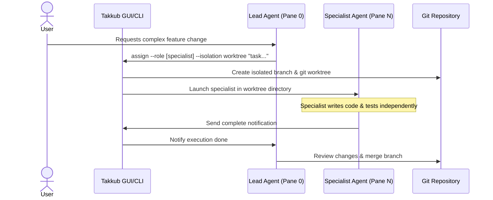

# Design Review & Redesign Proposal: agent-takkub README

- **Document Date:** July 4, 2026
- **Status:** Proposal / Draft
- **Target File:** `README.md`
- **Applicable Version:** `agent-takkub@1.0.2`

---

## 1. Executive Summary & Design Goals
The `agent-takkub` README is the entry point for both developers on GitHub and package consumers on npm. Since `agent-takkub` is a desktop cockpit UI for agent orchestration, it is critical that the README captures the visual power, parallel multitasking capabilities, and local-first architecture of the tool at first glance. 

Our redesign goals are:
1. **Visual Impact:** Put the actual Cockpit UI front-and-center using screenshot placeholders and high-quality flow diagrams.
2. **Clear Value Proposition:** Elevate the unique selling points (Lead/Specialist architecture, Git worktree isolation, multi-mode fleets) above installation instructions.
3. **Cross-Platform Compatibility:** Ensure perfect rendering on both GitHub and npmjs.com. This requires absolute URL mappings for all images and internal files, and strictly avoiding HTML/CSS tags that npmjs.com strips.
4. **Actionability:** Include a concrete capture guide for the cockpit screenshots so developers can generate the necessary assets under `assets/`.

---

## 2. Current README.md Audit & Pain Points

| Section | Current Issue | Redesign Strategy |
| :--- | :--- | :--- |
| **Hero / Header** | Centered using `<div align="center">`. The layout is simple but does not present a cohesive visual identity or clear prerequisite badges. | Use standard Markdown headers with clean, badges on their own lines. Add a high-resolution hero screenshot immediately below the header. |
| **Why (Value Prop)** | Placed after "Install". Uses basic bullet points. Emojis and hierarchy are present but lack typographic breathing room. | Rename to **Key Features**. Move it *before* the installation guide. Group and format features with bold headers and descriptive bullet points for scannability. |
| **The Flow** | Uses a primitive text-based ASCII flowchart (`you -> Lead -> assign...`) that doesn't capture worktrees, branches, or process lifecycle. | Replace with a high-fidelity Mermaid sequence/flowchart showing the orchestration between CLI/GUI, Git worktrees, and Claude processes. |
| **Everyday Commands** | Table columns are sparse (just "Command" and "Description" in unnamed column). Misses key option flags. | Format table with clean, named headers (`Command`, `Action / Purpose`, `Common Options / Flags`) and improve explanations. |
| **Links / More** | Relative markdown links (`[docs/ARCHITECTURE.md](docs/ARCHITECTURE.md)`) break completely on npmjs.com because npm does not resolve relative paths to GitHub. | Convert all project resource links to absolute GitHub URLs pointing to the `main` branch. |

---

## 3. GitHub & npmjs.com Compatibility Guidelines

To ensure the new README renders flawlessly on both platforms:
- **No Inline Styles / Complex HTML:** npmjs.com ignores `<div style="...">` and strips custom styles. Use vanilla Markdown syntax (e.g., standard headers, blockquotes, tables).
- **Absolute File Links:** Any link pointing to another file in the repository (e.g., `docs/ARCHITECTURE.md`) must be fully qualified: `https://github.com/takkub/agent-takkub/blob/main/docs/ARCHITECTURE.md`.
- **Absolute Raw Image URLs:** All screenshots and images must point to GitHub's raw content delivery network: `https://raw.githubusercontent.com/takkub/agent-takkub/main/assets/...`.
- **Safe Tables:** Keep markdown tables simple; do not embed blockquotes or lists inside cells, as they render inconsistently.

---

## 4. Visual Assets & Screenshot Capture Guide (TODOs)

The following assets must be captured and placed in the `/assets` directory of the repository to support this redesign:

### 1. Hero Image: `assets/cockpit-main.png`
- **What to capture:** A full screenshot of Takkub Cockpit running on Windows/macOS.
- **Cockpit State:**
  - One project tab active (e.g., `agent-takkub`).
  - Left pane: The **Lead** agent showing an orchestration prompt (e.g., *"Assigning frontend feature branch..."*).
  - Right panes: Three active specialist panes open concurrently (`frontend`, `backend`, and `qa`), showing live terminal output.
- **Caption:** *Takkub Cockpit: Orchestrate multiple Claude Code specialists from a single terminal-backed desktop window.*

### 2. Isolation Visualizer: `assets/worktree-isolation.png`
- **What to capture:** A split view showing:
  - Left: The cockpit running a task with the `--isolation worktree` flag.
  - Right: A terminal displaying `git worktree list`, proving that Takkub spawned the specialist in an isolated directory on a separate branch.
- **Caption:** *Automated worktree isolation prevents commit races and file conflicts.*

### 3. Fleet Mode: `assets/fleet-mode.png`
- **What to capture:** A cropped visual of the cockpit running with "Multi-mode" enabled.
- **Cockpit State:**
  - Multiple concurrent instances of the same specialist role (e.g., `frontend#1`, `frontend#2`, `frontend#3`) processing distinct tasks or test shards simultaneously.
- **Caption:** *Fleet mode: Scale up your specialists to process test suites or tasks in parallel.*

---

## 5. Proposed README.md Draft

Below is the complete markdown source code for the proposed `README.md`.

```markdown
# 🛩️ agent-takkub

**A local-first desktop cockpit for orchestrating a team of Claude Code agents in one unified window.**

[](https://www.npmjs.com/package/agent-takkub)
[](https://github.com/takkub/agent-takkub/blob/main/LICENSE)
[](https://github.com/takkub/agent-takkub)
[](https://www.python.org/)
[](https://nodejs.org/)

---

## 🖥️ The Desktop Cockpit


*Takkub Cockpit: Orchestrate multiple Claude Code specialists from a single terminal-backed desktop window.*

---

## ✨ Why agent-takkub?

When building complex software, a single AI agent can struggle with context limit and conflicting sub-tasks. `agent-takkub` introduces the **Lead-Specialist pattern**: you prompt a **Lead** manager agent, and it delegates isolated, specialized sub-tasks to custom specialist processes running concurrently.

* **🧠 Orchestrated Teammates:** Converse with a master **Lead** process; it automatically spawns, tasks, and manages specialist panes (e.g., `frontend`, `backend`, `qa`, `reviewer`, `devops`) as needed.
* **🔀 True Parallelism:** Distribute tasks across independent specialists. Have `frontend` and `backend` build features concurrently, while `qa` runs automated tests in the background.
* **🌿 Branch & Worktree Isolation:** Teammates work in separate git branches and isolated git worktrees. This prevents file conflicts, overwrite races, and dirty state.
* **👥 Fleet Mode:** Scale your workspace to match your hardware. Spin up multiple concurrent instances of a single role (e.g., `frontend#1`, `frontend#2`) to run heavy tasks in parallel.
* **🖥️ Steerable Processes:** Every agent pane is a real, live `claude` shell. Watch their logs in real-time, interrupt them, or type directly into their terminals.
* **🔒 100% Local & Secure:** No cloud middleware, no SaaS API wrapper. Runs entirely on your machine via PySide6/PyQt6 and your existing authenticated Claude Code CLI.

---

## ⚡ Quick Start

### 1. Install & Authenticate
Install `agent-takkub` globally, make sure your Claude account is logged in, and provision the required environment tools:

```bash
# Install the cockpit globally
npm install -g agent-takkub

# Authenticate with your Claude account (if not already done)
claude login

# Provision essential browser automation tools and skills
takkub provision
```

### 2. Launch
Double-click the **Takkub Cockpit** icon on your Desktop, or start it directly from your terminal:
```bash
agent-takkub
```

> **Requirements:** Node.js ≥ 18 and Python ≥ 3.11 must be installed on your system. Everything else runs inside an isolated environment in `~/.agent-takkub` without modifying your global setups.

---

## 🔄 Orchestration Flow

`agent-takkub` leverages Git worktrees to isolate workspace directories for each running specialist. Here is how tasks fan out and merge back:



---

## 🛠️ Everyday Commands

You can run commands from the Lead's console or your own terminal to control the cockpit:

| Command | Action / Purpose | Common Flags |
| :--- | :--- | :--- |
| `takkub assign` | Spawn a specialist agent and assign a task. | `--role <name>` (e.g. backend)<br>`--isolation worktree`<br>`--plan` (forces step plan) |
| `takkub worktree` | Manage isolated workspaces and git worktrees. | `list` (show all worktrees)<br>`merge` (merge branch)<br>`clean` (remove worktree) |
| `takkub send` | Message an active agent pane (automatically CCs the Lead). | `--to <role>` (target pane)<br>`"<message>"` |
| `takkub doctor` | Run self-diagnostic checks on Node, Python, and Claude. | `--fix` (automatically repair issues) |
| `takkub provision` | Download and setup default plugins, skills, and Playwright. | *(None)* |
| `takkub restart` | Perform a clean restart of the cockpit GUI processes. | *(None)* |

---

## 📖 Deep Dives & Resources

- 🏗️ **Architecture & Design:** Learn how Takkub orchestrates concurrent CLI processes in the [Architecture Guide](https://github.com/takkub/agent-takkub/blob/main/docs/ARCHITECTURE.md).
- ⚙️ **Detailed System Overview:** Explore diagrams and flow specifications in the [System Overview folder](https://github.com/takkub/agent-takkub/tree/main/docs/system-overview).
- 🔧 **Custom Installation & Source Build:** Find setup help for offline or source-based environments in [INSTALL.md](https://github.com/takkub/agent-takkub/blob/main/docs/INSTALL.md).
- 📋 **System Prerequisites:** See library and package dependencies in [REQUIREMENTS.md](https://github.com/takkub/agent-takkub/blob/main/docs/REQUIREMENTS.md).

---

<div align="center">
  <sub>Windows & macOS • Powered by Claude Code • Licensed under MIT</sub>
</div>
```

---

## 6. Next Steps & Asset Generation Workflow

To finalize the release of the redesigned README:
1. **Asset Creation:** Capture the three screenshots specified in the capture guide using the Takkub Cockpit GUI.
2. **Commit Assets:** Save them as `assets/cockpit-main.png`, `assets/worktree-isolation.png`, and `assets/fleet-mode.png`.
3. **Overwrite README:** Replace the contents of the root `README.md` with the proposed draft (which will immediately begin rendering the new layout once pushed to the default branch).
