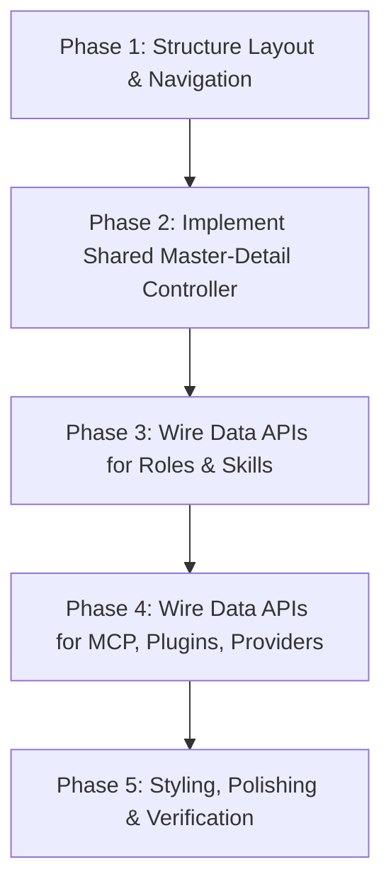

# Takkub Cockpit Settings Redesign Plan
**Document Version:** 1.0.0  
**Date:** July 11, 2026  
**Author:** Gemini Teammate (AI Design Specialist)

---

## 1. Goal & Context
The Settings window of Takkub Cockpit (`settings_window.py`) has grown organically. As a result, the User Experience (UX) has become fragmented: actions are scattered across different screens (e.g., creating a role in one tab, deleting it in another, setting skill policies in a matrix, and assigning MCP/plugins in yet another matrix). Users complain that the UI feels confusing, inconsistent, and difficult to navigate.

The goal of this redesign is to consolidate **Roles, Skills, MCP Servers, Plugins, and Providers** into a unified, predictable, and visually stunning settings experience. We will strictly adhere to the `cockpit-ui-style` design tokens (gold `#E3B341` accent, tinted dark grounds, and IBM Plex fonts).

---

## 2. Information Architecture (IA) Options

To structure the redesigned Settings window, we evaluate two information architecture models:

### Option A: Uniform Sidebar Navigation (Recommended)
This approach places all 5 entities directly in the left-hand sidebar navigation under dedicated sections. Clicking any of them reveals a uniform **Master-Detail Split Layout**.

```
+-------------------------------------------------------------+
| Sidebar (PIPELINE / ROLE / TOOLS / SKILL / ACCOUNT)         |
|   -> Selecting "Roles" opens the Roles Master-Detail        |
|   -> Selecting "Skills" opens the Skills Master-Detail      |
+-------------------------------------------------------------+
```

* **Pros:**
  * **Zero guessing:** High discoverability. The user sees exactly what configuration targets exist immediately upon opening the window.
  * **Ultra-consistent:** Clicking any navigation link drops the user into the exact same pattern (Search + List + Detail).
  * **High efficiency:** Minimizes clicks. No need to open modals or drill down from a dashboard.
  * **Perfect screen utilization:** Utilizes the generous window canvas ($1320 \times 848$ px) perfectly without wrapping or cramped scroll areas.
* **Cons:**
  * Increases the number of sidebar navigation items (adds 2-3 links to the sidebar).

### Option B: Hub-and-Detail Dashboard
A centralized dashboard page ("System Settings") with cards representing each entity (e.g., a card for Roles, a card for Skills). Clicking a card opens a modal overlay or switches the main view to a detail page.

```
+-------------------------------------------------------------+
| Sidebar (Dashboard / Pipelines / Account)                   |
|   -> Dashboard shows cards: [Roles (12)]  [Skills (8)] ...  |
|   -> Clicking a card drill-downs or opens a modal           |
+-------------------------------------------------------------+
```

* **Pros:**
  * Keeps the sidebar extremely clean and compact.
  * Provides a high-level count/health summary on the landing screen.
* **Cons:**
  * **High interaction cost:** Adds an extra navigation step (click card -> enter detail -> click back to exit).
  * **Cramped overlays:** Modals running inside the desktop app often feel cramped when editing rich fields (e.g., role instructions markdown or custom MCP environment variables).
  * **Breaks focus:** The user cannot quickly toggle between different settings without returning to the hub.

### Final Verdict & Recommendation
We select **Option A (Uniform Sidebar Navigation)**. In a tool meant for developer operations, quick access and muscle memory are paramount. Modals and dashboards add unnecessary friction. The sidebar sections (ROLE, TOOLS, SKILL) are already structured nicely; Option A expands on this layout with maximum predictability.

---

## 3. The Unified Interaction Pattern (Master-Detail Split Layout)

To eliminate the "organic growth" confusion, every one of the 5 menus will use the **exact same layout and interaction sequence**. If the user learns how to configure Roles, they instantly know how to configure MCP Servers, Skills, Plugins, and Providers.

```
+---------------------------------------------------------------------------------+
|                                 Header Panel                                    |
+---------------------------------------------------------------------------------+
|  Search/Filter        |                                                         |
|  [ QLineEdit        ] |                Right Detail/Edit Pane                   |
|                       |                                                         |
|  +------------------+ |  Contains the form fields for the selected item.       |
|  | Item 1       [x] | |                                                         |
|  | Item 2       [x] | |  For Read-Only entities (e.g., built-in roles/skills):  |
|  | Item 3       [x] | |  - A lock banner appears at the top.                    |
|  +------------------+ |  - All form controls are disabled.                      |
|                       |                                                         |
|  [+ New Entity Button]|  [ Revert Changes ]                    [ Save & Apply ] |
+---------------------------------------------------------------------------------+
```

### Layout Split
* **Left-Side Master List ($1/3$ width, minimum 320px):**
  * **Search Bar:** A clean `QLineEdit` at the top with a magnifying glass placeholder.
  * **List Widget:** A custom `QListWidget` using `GROUND_PANEL` backgrounds, showing the name, status badge (e.g. system vs. custom, enabled vs. disabled), and a delete icon on hover.
  * **Create Button:** A secondary action button (`secondary_button`) at the bottom of the list saying `＋ Add New <Entity>`.
* **Right-Side Detail Editor ($2/3$ width):**
  * **Empty State:** When no item is selected, a subtle placeholder banner with a gold-bordered icon is shown: *"Select an item from the list to view or edit its settings."*
  * **Form Fields:** Form fields corresponding to the entity's properties.
  * **Action Footer:** "Revert Changes" (restores the detail view to on-disk state) and "Save & Apply" (staged writes are committed).

### CRUD Behavior Specs
1. **Create:** Clicking `＋ Add New <Entity>` clears the selection on the left, updates the right pane with an empty form with default placeholders, and focuses the first input field (e.g., "Name").
2. **Read/Edit:** Clicking a list item updates the right-side detail pane.
3. **Delete:** A small trash can icon `🗑` appears on the row of custom/user-added items. Clicking this icon or a dedicated `Delete` button in the Edit pane triggers a standard PyQt6 confirmation box:
   * **Title:** Delete `<Entity>`
   * **Message:** "Are you sure you want to delete this <Entity>? This action cannot be undone."
   * **Action:** Atomic file deletion and state refresh.
4. **Read-Only Lockout:** For built-in assets, the trash icon is hidden. In the edit pane, a subtle warning banner using `GROUND_INPUT` with `ACCENT_GOLD` styling is displayed:
   * `🔒 System Role: Modifying or deleting built-in roles is not allowed.`
   * All inputs in the detail editor are set to `setEnabled(False)`.

---

## 4. Cockpit Theme & Design Tokens Integration

We strictly adhere to `src/agent_takkub/cockpit_theme.py`. No hex codes or layout variables will be hardcoded.

```python
from . import cockpit_theme as theme
```

* **Colors & Backgrounds:**
  * App Backdrop: `GROUND_BODY` (`#050608`)
  * Content Surfaces & Panels: `GROUND_PANEL` (`#181b21`)
  * Item Hover State: `GROUND_INPUT` (`#1c1f26`)
  * Selected Items: `GROUND_SELECT` (`#232732`)
  * Text Colors: `TEXT_PRIMARY` (`#f2f3f5`) for headings, `TEXT_SECONDARY` (`#c7ccd4`) for labels, `TEXT_MUTED` (`#7b828f`) for hints.
* **Accents & States:**
  * Active indicators / Checkbox-checked / Focus: `ACCENT_GOLD` (`#E3B341`)
  * Primary Action Buttons: `theme.gold_button()` (uses gold gradient text, dark bold text)
  * Secondary Action Buttons: `theme.secondary_button()` (transparent outline, `BORDER_STRONG`)
  * Toggle Switches: `theme.ToggleSwitch` (custom switch; active state = Gold)
* **Fonts & Typography:**
  * Sans family: `fonts["sans"]` (IBM Plex Sans fallback) for standard labels and inputs.
  * Mono family: `fonts["mono"]` (IBM Plex Mono fallback) for paths, system names, and code.
* **Borders & Radii:**
  * Thin dividers: `BORDER_HAIRLINE` (`rgba(255,255,255,0.06)`)
  * Small inputs: `RADIUS_SM` (8px), Panels/Cards: `RADIUS_MD` (10px)

---

## 5. Screen Layout ASCII Mockups & Interactions

Below are the detailed layout mockups for all 5 entities.

### 5.1 Roles Redesign
* **Data File:** `~/.takkub/custom-roles.json` (metadata) + `<config.CUSTOM_AGENTS_DIR>/<name>.md` (instructions)
* **Interaction:** Setting skills, MCPs, and plugins for the role is done directly within the tabs of this details pane.

```
+-----------------------------------------------------------------------------------------------------+
| Settings > Roles                                                                                    |
+-----------------------------------------------------------------------------------------------------+
| SEARCH ROLES                               |  ROLE DETAILS: backend                                 |
| [ Search roles...                     ]    |                                                        |
|                                            |  [ General Settings ]  [ Skills ]  [ MCP & Plugins ]   |
| +----------------------------------------+ |                                                        |
| | Lead                    [System Role]  | |  Name:        [ backend                              ] |
| | Frontend                [System Role]  | |  Label:       [ Backend                              ] |
| | Backend                 [System Role]  | |  Color:       [ #4E86F7 ] (o) Select Color            |
| | Custom Specialist-1     [Custom]  [🗑] | |  Column:      ( ) 1 (Dev)   (*) 2 (Support)            |
| | Custom Specialist-2     [Custom]  [🗑] | |  Provider:    [ Codex (OpenAI)                    [^] ] |
| +----------------------------------------+ |                                                        |
|                                            |  Instructions:                                         |
|                                            |  +--------------------------------------------------+  |
|                                            |  | # Backend                                        |  |
|                                            |  | คุณคือ Backend Developer หน้าที่ของคุณคือสร้าง API...     |  |
|                                            |  +--------------------------------------------------+  |
|                                            |                                                        |
| [＋ Add New Role]                          |  [ Revert Changes ]                     [Save & Apply] |
+-----------------------------------------------------------------------------------------------------+
```

#### Skills Tab View (within Roles screen)
```
+-----------------------------------------------------------------------------------------------------+
| [ General Settings ]  [*Skills*]  [ MCP & Plugins ]                                                 |
|                                                                                                     |
| Assign Skills to this Role:                                                                         |
|                                                                                                     |
| [ ] check-git-logs        - Read git commit messages and branch summaries.                          |
| [*] database-mysql-check  - Scan and diagnostic tool for MySQL.                                     |
| [*] docker-compose-verify - Validate docker files and environments.                                 |
| [ ] snyk-scanner-plugin   - Security scans.                                                         |
|                                                                                                     |
+-----------------------------------------------------------------------------------------------------+
```

* **Interactions:**
  * Selecting a role updates the General Settings form, checking the checkboxes in the Skills and MCP & Plugins tabs dynamically using the data loaded from `skill_policy.json` and `pane-tools.json`.
  * **System Role Lockout:** Selecting `lead` or `backend` shows the warnings, disables name editing, disables deleting, but allows mapping customizations (such as enabling/disabling skills or MCPs) if editable by the system policy.

---

### 5.2 Skills Redesign
* **Data Layer:** `skill_scan.py` (reads `.claude/skills/*/SKILL.md`), maps policies to `skill_policy.json`.
* **Interaction:** Adding a new skill writes a new folder and `SKILL.md` to `.claude/skills/`.

```
+-----------------------------------------------------------------------------------------------------+
| Settings > Skills                                                                                   |
+-----------------------------------------------------------------------------------------------------+
| SEARCH SKILLS                              |  SKILL DETAILS: database-mysql-check                   |
| [ Search skills...                    ]    |                                                        |
|                                            |  🔒 Bundled Skill: This skill is read-only.            |
| +----------------------------------------+ |                                                        |
| | check-git-logs          [Bundled]      | |  Name:        [ database-mysql-check                 ] |
| | database-mysql-check    [Bundled]      | |  Description: [ Scan and diagnostic tool for MySQL.  ] |
| | custom-validator        [Project] [🗑] | |                                                        |
|                                            |  Markdown Content (SKILL.md):                          |
|                                            |  +--------------------------------------------------+  |
|                                            |  | ---                                              |  |
|                                            |  | name: database-mysql-check                       |  |
|                                            |  | description: Scan and diagnostic tool for MySQL. |  |
|                                            |  | ---                                              |  |
|                                            |  | # Database MySQL Check                           |  |
|                                            |  | Instructions on running database checks...       |  |
|                                            |  +--------------------------------------------------+  |
|                                            |                                                        |
| [＋ Add New Skill]                         |  [ Revert Changes ]                     [Save & Apply] |
+-----------------------------------------------------------------------------------------------------+
```

* **Interactions:**
  * When editing a **Project** (custom) skill, the Markdown editor is fully interactive.
  * Saving the skill writes the frontmatter yaml and instructions text to `.claude/skills/<name>/SKILL.md`.

---

### 5.3 MCP Servers Redesign
* **Data Layer:** `pane_tools_policy.py` (`pane-tools.json` and `shared_dev_tools.py`)
* **Interaction:** Adding a new MCP registers it in the JSON config.

```
+-----------------------------------------------------------------------------------------------------+
| Settings > MCP Servers                                                                              |
+-----------------------------------------------------------------------------------------------------+
| SEARCH MCP SERVERS                         |  MCP DETAILS: sqlite-mcp                               |
| [ Search MCP servers...               ]    |                                                        |
|                                            |  Name:        [ sqlite-mcp                           ] |
| +----------------------------------------+ |  Command:     [ npx -y @modelcontextprotocol/sqlite  ] |
| | playwright              [Enabled]      | |  Arguments:   [ --db /path/to/db.sqlite              ] |
| | sqlite-mcp              [Enabled]  [🗑] | |                                                        |
| | filesystem              [Disabled] [🗑] | |  Environment Variables:                                 |
|                                            |  [+] Add Env  [-] Remove Selected                       |
|                                            |  +--------------------------------------------------+  |
|                                            |  | Key                 | Value                      |  |
|                                            |  |---------------------+----------------------------|  |
|                                            |  | SQLITE_TIMEOUT_MS   | 5000                       |  |
|                                            |  +--------------------------------------------------+  |
|                                            |                                                        |
| [＋ Add New MCP]                           |  [ Revert Changes ]                     [Save & Apply] |
+-----------------------------------------------------------------------------------------------------+
```

* **Interactions:**
  * Toggling the MCP's operational state dynamically edits its execution parameters.
  * Adding env vars uses an inline table editable row-by-row.

---

### 5.4 Plugins Redesign
* **Data Layer:** `pane_tools_policy.py` / `plugin_installer.py`
* **Interaction:** Install or customize plugins.

```
+-----------------------------------------------------------------------------------------------------+
| Settings > Plugins                                                                                  |
+-----------------------------------------------------------------------------------------------------+
| SEARCH PLUGINS                             |  PLUGIN DETAILS: chrome-devtools                       |
| [ Search plugins...                   ]    |                                                        |
|                                            |  🔒 Bundled Plugin: Read-only plugin.                  |
| +----------------------------------------+ |                                                        |
| | snyk-security           [Active]       | |  Name:        [ chrome-devtools                      ] |
| | chrome-devtools         [Active]       | |  Path:        [ ~/.takkub/plugins/chrome-devtools    ] |
| | custom-linter           [Active]   [🗑] | |  Status:      [ Active                            [^] ] |
|                                            |                                                        |
|                                            |  Plugin Options:                                       |
|                                            |  [ ] Debug Mode                                        |
|                                            |  [ ] Auto-update Plugin                                |
|                                            |                                                        |
| [＋ Install Plugin]                        |  [ Revert Changes ]                     [Save & Apply] |
+-----------------------------------------------------------------------------------------------------+
```

---

### 5.5 Providers Redesign
* **Data Layer:** `provider_config.py` and `provider_state.py` (reads `disabled-providers.json`).
* **Interaction:** Toggle provider status globally and map role configurations.

```
+-----------------------------------------------------------------------------------------------------+
| Settings > Providers                                                                                |
+-----------------------------------------------------------------------------------------------------+
| SEARCH PROVIDERS                           |  PROVIDER DETAILS: gemini                              |
| [ Search providers...                 ]    |                                                        |
|                                            |  Name:        [ gemini                               ] |
| +----------------------------------------+ |  Description: [ Google Antigravity (agy)             ] |
| | claude                  [Active]       | |  Status:      [x] Enabled (Global Toggle)              |
| | gemini                  [Active]       | |                                                        |
| | codex                   [Disabled]     | |  CLI Executable:                                       |
|                                            |  Path:        [ C:/Users/monch/AppData/Local/bin/agy ] |
|                                            |  [🔍 Verify Installation]   (Result: Found v2.1.0)      |
|                                            |                                                        |
|                                            |  Install Instructions:                                   |
|                                            |  "Install agy CLI from https://antigravity.google/     |
|                                            |   download, then run `agy` once to sign in."           |
|                                            |                                                        |
|                                            |  Roles Mapped to this Provider:                          |
|                                            |  - Critic (Design Critic)                                |
|                                            |  - Gemini (Planning brain)                               |
|                                            |                                                        |
|                                            |  [ Revert Changes ]                     [Save & Apply] |
+-----------------------------------------------------------------------------------------------------+
```

* **Interactions:**
  * Toggling "Enabled" writes to `disabled-providers.json` globally.
  * Clicking "Verify Installation" tests the PATH and executes the binary with `--version` or similar, rendering result badges in real-time.

---

## 6. Detailed Implementation & Wiring Guide

To ensure robust implementation, we define the following program flow and transaction mechanics for the PyQt6 application:

### A. State Management & Staging Changes
To prevent half-saved states, any change to a form input sets the view status to `dirty`. 
* We track dirty states per page index in `self._dirty_views`.
* When the user clicks **Save & Apply**, we perform an atomic transaction across all modified configs (backed by a snapshot/rollback mechanism).

```python
# Snapshot paths before writing
snapshot_paths = (
    provider_config.config_path(self._project),
    pipeline_config.path(self._project),
    pane_tools_policy.PANE_TOOLS_POLICY_FILE,
    skill_policy.SKILL_POLICY_FILE,
)
# If write fails, restore old bytes.
```

### B. PyQt6 Layout Structure (Standardizing UI Code)
Instead of custom styles, we implement the page using helper classes:
* Use a horizontal layout container: `QHBoxLayout`
* Left side: `QVBoxLayout` containing `QLineEdit` (Search) and a custom themed `QListWidget`.
* Right side: `QStackedWidget` containing the Edit Form view and the Empty State view.
* Form rows are standard `QFormLayout` layouts, using `theme.ToggleSwitch` and `theme.secondary_button()`.

### C. Search & Filter Mechanism
We bind a dynamic search filter to the list view using a search text field:
```python
def _on_search_changed(self, text: str) -> None:
    text = text.lower().strip()
    for row in range(self._list_widget.count()):
        item = self._list_widget.item(row)
        item.setHidden(text not in item.text().lower())
```

---

## 7. Migration Plan



1. **Phase 1: Navigation & Ground Layouts**
   * Update `settings_window.py` to use Option A sidebar links.
   * Build the UI wrapper classes for the split list-detail panel.
2. **Phase 2: Master-Detail Implementation**
   * Wire the QListWidget hover states, Search queries, and empty state cards.
3. **Phase 3: Role & Skill CRUD Wiring**
   * Replace the older Role creation wizard with the right details edit panel.
   * Wire custom skill creation `.md` file generators and mapping to `skill-policy.json`.
4. **Phase 4: Tools & Providers Wiring**
   * Implement MCP / Plugins config parsing and dynamic provider validations.
5. **Phase 5: Visual Polish**
   * Add hover micro-animations to list items.
   * Integrate lock badges for system dependencies.
   * Verify using PyQt tests.
