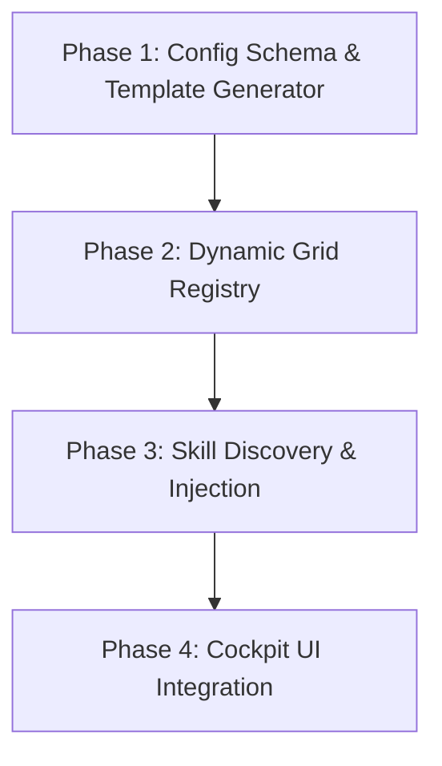

# Gemini Cross-Check of Core Upgrade Plan (2026-07-09)

This document contains a comprehensive architectural and planning cross-check of the Lead's core upgrade plan (`docs/plans/2026-07-09-core-upgrade-plan.md`).

---

## 1. Item-by-Item Verdict & Critique

Below is the verification of all 10 items against the codebase, along with what the plan under/over-estimates.

### 1. File-based task handoff + artifacts out of real project folders
*   **Verdict**: ✅ **Agree**
*   **Underestimates**: 
    *   **Agent Permissions**: Teammate panes spawned under sandbox rules may lack access permissions to `~/.takkub/runtime/tasks/` if it's outside their allowed workspace paths.
    *   **Prompt template adjustments**: The system must update `CLAUDE.md` / role prompts to explicitly teach the agent to recognize the file-pointer syntax and read the task file instead of treating it as a literal instruction or reporting a blank task.
*   **Overestimates**: None. This is highly necessary to prevent the copy-paste buffer truncation issues on Windows terminals.

### 2. Remove machine capability limits
*   **Verdict**: ⚠️ **Agree with Caution**
*   **Underestimates**: 
    *   **Oversubscription Risk**: If the advisory cap `Cap K <= {cap}` is removed from the Lead prompt entirely and `TAKKUB_QUEUE_FANOUT` is default OFF, the Lead will assume infinite machine capacity. It may trigger 10+ concurrent spawns on a dual-core machine, leading to severe thrashing and system freeze.
    *   **Mitigation**: We should retain the prompt limit *unless* `TAKKUB_QUEUE_FANOUT` is active, or make the prompt advise the Lead to sequence tasks in waves based on the estimated cost of each role.
*   **Overestimates**: None.

### 3. Draft-typing race — done notice drags user's half-typed text
*   **Verdict**: ✅ **Agree**
*   **Underestimates**:
    *   **Backspace/Delete handling**: Simply checking "printable bytes => draft on" and "Enter/Esc/Ctrl+C => clear" fails if the user erases their draft using Backspace. The cockpit would see `draft_pending` as `True` and hold notifications for 3 minutes even though the terminal input is empty.
    *   **Mitigation**: Track the net draft length (`draft_len = max(0, draft_len + added - backspaces)`). If the length hits 0, clear the draft state immediately.
*   **Overestimates**: None.

### 4. Run /remote-control on every Lead spawn
*   **Verdict**: ✅ **Agree**
*   **Underestimates**: 
    *   **Collision with manual inputs**: Triggering this automatically on every spawn (including auto-respawns) can collide with user keystrokes if the user immediately starts typing. It relies heavily on the success of the draft-typing check (Item 3) to defer safely.
*   **Overestimates**: None.

### 5. QA must attach screenshot evidence to every done
*   **Verdict**: ⚠️ **Agree with Adjustments**
*   **Underestimates**:
    *   **State variables**: `PaneState` currently does NOT track `spawn_ts` or `assign_ts`. We must add `assign_ts` to `PaneState` to evaluate which screenshots are "newer than the pane's assign timestamp".
    *   **Role specificity**: Appending warnings for non-UI roles (e.g. `backend`, `devops`, `reviewer`) that finish with zero screenshots will result in annoying false-positive spam. The warning flag should only target UI-heavy/Test-ish roles (e.g. `qa`, `designer`, `frontend`).
*   **Overestimates**: None.

### 6. Role manager + skill library + shipped defaults
*   **Verdict**: ✅ **Agree**
*   **Underestimates**:
    *   **Qt Grid Layout Reflow**: Dynamically adding/editing roles requires the Qt UI to rebuild the 3-column grid layouts smoothly. Static row/column indexing in `roles.py` will need to be refactored into a dynamic grid positioning logic.
*   **Overestimates**: None. (Phased breakdown proposed in section 3).

### W1. Close project button
*   **Verdict**: ✅ **Agree**
*   **Underestimates**: 
    *   **Coupling to UI elements**: `_on_tab_close_requested` in `main_window.py` is tightly coupled to the Qt `QMessageBox` confirm dialog. To call this safely from the remote API, we must extract the tab closing logic into a headless method (e.g., `close_project_tab(project_name)`) that handles cleanup and tab removal without GUI modals.
*   **Overestimates**: None.

### W2. Brainstorm Q&A — tappable options + comment
*   **Verdict**: ❌ **Disagree with MVP Approach**
*   **Underestimates**:
    *   **TUI Picker mechanics**: Falling back to `lead_say` (which writes plain text to stdin) is non-viable for multiple-choice `AskUserQuestion` prompts. Claude Code's option picker expects specific raw keys (Arrow keys + Enter) and does not parse arbitrary text inputs as selection. 
    *   **Mitigation**: We must support sending raw arrow keys (`\x1b[B`, `\x1b[A`) and carriage return (`\r`) via the remote API to make the selection remote-drivable from day one.
*   **Overestimates**: The usability of `lead_say` as a fallback for option-selecting prompts.

### W3. Resume button + session picker
*   **Verdict**: ✅ **Agree**
*   **Underestimates**:
    *   **Session File Validity**: The PWA needs to read metadata from the JSONL files (such as timestamp and last query) to display a friendly history. Reading empty or corrupted JSONL files should be handled gracefully.
*   **Overestimates**: None.

### W4. Pulse shows Lead
*   **Verdict**: ✅ **Agree**
*   **Underestimates**: None. Safe to implement since it's just reading in-memory `_panes_by_project` state.
*   **Overestimates**: None.

---

## 2. (a) Wave Ordering & Dependency Analysis

The proposed wave ordering has three structural flaws:
1.  **Item 4 relies on Item 3**: Triggering `/remote-control` on every spawn (Item 4) without a working draft-typing race guard (Item 3) will result in `/remote-control` hijacking user typing if they begin typing right as a tab opens/resumes. Thus, **Item 4 must move to Wave 2** (alongside Item 3).
2.  **Item 5 shares State & File Touchpoints**: Item 5 (Screenshots newer than assign) requires adding `assign_ts` to `PaneState` and updating `orchestrator.py:done()`. Item 1 and Item 3 also touch the assign/done paths in `orchestrator.py`. Moving **Item 5 to Wave 2** consolidates all done/assign refactoring in a single sequential wave, avoiding merge conflicts.

### Recommended Wave Schedule:
*   **Wave 1 (Low Risk / Independent)**: #2 (Remove limits), W1 (Close tab API), W4 (Pulse Lead status)
*   **Wave 2 (Core PTY & State Mechanics)**: #1 (File handoff), #3 (Draft race), #4 (Spawn remote-control), #5 (Done screenshots + state timestamp)
*   **Wave 3 (Advanced & PWA Features)**: #6 (Role/Skill manager), W3 (Session picker), W2 (Options picker with Arrow-key driving)

---

## 3. (b) Item 6 (Role Manager + Skill Library) Phased Breakdown

To roll out the Role Manager and Skill Library safely, we propose the following 4-phase plan:

1.  **Phase 1: Config Schema & Template Generator**
    *   Define the JSON schema for `~/.takkub/roles.json`.
    *   Create helper methods to read/write custom roles and merge them with `ALL_DEFAULT` from `roles.py`.
    *   Implement template generation that creates the necessary `.claude/agents/<role>.md` file automatically when a role is defined.
    *   Update `takkub doctor --fix` to verify and install default templates into `~/.claude/agents/` if they are missing.
2.  **Phase 2: Dynamic Grid Registry**
    *   Modify `roles.py` to support dynamic grid row/column assignment rather than hardcoded tuples.
    *   Update `main_window.py`'s grid positioning layout logic to dynamically map spawned panes to their database-configured rows/columns.
    *   Add validation to prevent grid slot collisions.
3.  **Phase 3: Skill Discovery & Injection**
    *   Implement a parser to scan for custom skills under `~/.claude/skills/` and the project directory.
    *   Add skill allocation configuration (Matrix mapping a role to its active skills).
    *   Update `spawn_engine.py` to inject the selected skill files explicitly via `--plugin-dir` or CLI arguments during spawn.
4.  **Phase 4: Cockpit UI Integration**
    *   Build the **Role Manager UI** dialog in Qt (create custom roles, pick grid slot, select color, edit instructions).
    *   Build the **Skill Matrix UI** (checkbox table mapping roles to discovered skills).
    *   Update settings persistence to auto-save and reload the policy.

---

## 4. (c) Cross-Platform Risks (Windows ConPTY vs macOS pty)

The plan misses several platform-specific risks that will arise during implementation:

1.  **File Locking on Windows during Screenshots (Item 5)**:
    On Windows, files are locked when opened for writing. If the browser or WebDriver is still writing the PNG screenshot to `runtime/exports/...`, the engine-side scan in `done()` might fail with a `PermissionError` (Sharing Violation) when checking file stats or reading metadata. 
    *Mitigation*: Implement a retry loop with a small delay and handle `PermissionError` when scanning the screenshots directory.
2.  **Git Worktree Deletion Failures on Windows (Item 1 & isolation)**:
    If worktrees are used to isolate folders, Windows often fails to delete directories (`git worktree remove`) if any background process (e.g., node, python, or dev servers spawned by the teammate) is still running and holding a handle to a file inside the worktree.
    *Mitigation*: The `close()` process must ensure it kills the teammate's entire process tree (using Taskkill or similar process group termination) before trying to clean up git worktrees.
3.  **Path Traversal & Backslash Escaping on Windows (Item 1)**:
    Writing task specifications to file paths like `~/.takkub/runtime/...` returns Windows paths with backslashes (`\`). When these paths are pasted into Claude Code as pointers, Claude Code (often running under bash/git-bash environments) might escape them incorrectly (e.g. `\r` treated as carriage return, `\t` as tab).
    *Mitigation*: Paths printed or pasted as task pointers must be normalized to use forward slashes (`/`) even on Windows.
4.  **Keystroke Queue Timing differences (Item 3 & W2)**:
    Windows ConPTY translates keyboard input sequences differently than macOS raw PTY. Writing fast keystroke sequences (like Arrow Up/Down + Enter to select options in W2) can result in swallowed keys or incorrect selections on Windows if the terminal buffer isn't flushed correctly.
    *Mitigation*: Introduce small millisecond delays between injecting control characters (e.g., 20-50ms between Arrow Down and Enter) to let ConPTY process the console events reliably.
