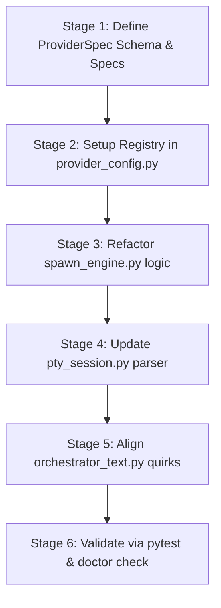

# ProviderSpec Architecture Design
**Wave 3 #6 Phase 0 (Issue #103) · Design Document**

---

## 1. Introduction and Goals

Today, the `agent-takkub` cockpit supports three terminal-based CLI providers to run teammate panes:
1. **Claude Code** (`claude`): The default provider with rich integration features (strict MCP configs, Obsidian vault sync, session-resume, stop/notification hooks).
2. **OpenAI Codex** (`codex`): Integrates via `AGENTS.md` cheatsheets, utilizes platform-specific sandbox evasion flags, and requires input flow adjustments.
3. **Google Antigravity** (`gemini` / `agy`): Google's retired standalone Gemini CLI replacement, using custom binary discovery pathways.

However, all provider-specific configurations—such as binary discovery logic, command line arguments (argv), ready/busy markers, bracketed paste input quirks, and MCP adapters—are currently hardcoded inside `spawn_engine.py`, `pty_session.py`, and `orchestrator_text.py`. 

This tight coupling violates open-closed principles. Adding or modifying a provider requires editing multiple core engine files.

### Design Goals
* **Decouple Provider Logic**: Move all vendor-specific parameters into a declarative registry.
* **Unified Registry**: Maintain a single source of truth for all providers, including custom or future CLI additions.
* **Minimize Engine Edits**: Shift provider-specific parameters to the declarative registry to prevent engine code sprawl. Note that complex subsystems (e.g., token metering, remote history, and custom MCP adapter mechanics like `plugin_import` vs `cmd_args`) are still resolved via engine logic.
* **Clarify the Role-Class Routing Axis (Lead vs. Teammate)**: Acknowledge that the cockpit distinguishes behaviors not only by provider but also by role class (Lead vs. Teammate). The engine will continue to handle role-class logic (such as context formatting, workspace-write tokens, specific command allowances, and folder trust overrides) internally, ensuring the `ProviderSpec` remains focused on raw CLI capabilities.
* **Cross-Platform Parity**: Ensure dynamic argument generation and file paths function seamlessly across Windows and macOS.

---

## 2. ProviderSpec Schema Definition

We define the `ProviderSpec` data structure as a Python `@dataclass`. It defines how the cockpit interacts with each CLI provider, covering lifecycle, terminal monitoring, input mechanics, and integrations.

### 2.1 Python Schema Class

```python
from dataclasses import dataclass, field
from typing import Dict, List, Optional, Tuple, Callable

@dataclass
class ReadyRule:
    """Rule to classify whether a screen footer represents an idle ready state."""
    marker: str
    ready_when: bool


@dataclass
class ProviderSpec:
    name: str  # Unique identifier for the provider (e.g., "claude", "codex", "gemini")
    
    # ─── 1. Binary Discovery ───
    binary_names: List[str]  # e.g., ["claude", "claude.exe"] or ["agy", "agy.exe"]
    install_instructions: str  # Help text displayed if binary is missing
    custom_discovery_fn: Optional[Callable[[], Optional[str]]] = None  # Direct callable for path lookup
    
    # ─── 2. Spawn Argv Builder ───
    # Maps sys.platform (or "default") to list of static startup arguments
    autonomy_flags: Dict[str, List[str]] = field(default_factory=dict)
    extra_static_args: List[str] = field(default_factory=list)
    
    # ─── 3. CLI Argument Mapping Flags ───
    mcp_config_flag: Optional[str] = None  # Argument name to pass MCP config (e.g., "--mcp-config")
    strict_mcp_flag: Optional[str] = None  # e.g., "--strict-mcp-config"
    system_prompt_flag: Optional[str] = None  # e.g., "--append-system-prompt-file"
    session_id_flag: Optional[str] = None  # e.g., "--session-id"
    session_resume_flag: Optional[str] = None  # e.g., "--resume"
    
    # ─── 4. Ready / Busy / Blocker Markers ───
    ready_hard_blockers: List[str] = field(default_factory=list)
    ready_rules: List[ReadyRule] = field(default_factory=list)
    ready_wait_ms: int = 45000  # How long to wait for ready status on launch (default: 45s)
    
    # ─── 5. Context Injection Strategy ───
    context_strategy: str = "none"  # "append_system_prompt_file", "agents_md_file", or "none"
    cheatsheet_filename: Optional[str] = None  # "CLAUDE.md" or "AGENTS.md"
    inline_learned_notes: bool = False  # If True, injects full learned-notes content
    use_file_guards: bool = False  # Appends BIG_FILE_GUARD / STALE_FILE_GUARD to prompt
    
    # ─── 6. MCP Adapter Variants ───
    mcp_adapter_variant: str = "none"  # "strict", "cmd_args", "plugin_import", or "none"
    supports_browser_profiles: bool = False  # Can isolate playwright / chrome-devtools profiles
    
    # ─── 7. Input Quirks ───
    paste_threshold: int = 200  # Character threshold for bracketed paste mode
    enter_delay_base_ms: int = 800  # Base delay between pasting text and writing carriage return (\r)
    enter_delay_per_kb_ms: int = 150  # Dynamic delay increase per KB pasted (to allow TUI render)
    enter_delay_max_ms: int = 3000  # Cap on the enter delay
    input_swallow_recovery: bool = True  # Auto-retry carriage return if TUI swallowed the enter key (#99)
    
    # ─── 8. Spawning Capability Flags ───
    supports_mirror: bool = False  # Vault decision logs / Obsidian Dataview mirroring sync
    supports_resume: bool = False  # Supports resuming existing sessions via UUID
    supports_slash_commands: bool = False  # Injects /remote-control on startup
    supports_hooks: bool = False  # Wire stop/notification hooks using JSON files
    
    # ─── 9. Claude/Provider Branch Specific Knobs ───
    plugin_dirs: List[str] = field(default_factory=list)  # Directories for custom plugins / superpowers
    disallowed_tools: List[str] = field(default_factory=list)  # Tools blocked for this provider
    model_flag: Optional[str] = None  # Argument to override base model (e.g. "--model")
    effort_flag: Optional[str] = None  # Argument to override reasoning effort (e.g. "--effort")
    fallback_model_flag: Optional[str] = None  # Argument to specify fallback model (e.g. "--fallback-model")
    settings_flag: Optional[str] = None  # Hook settings file argument (e.g., "--settings")
    task_notice_preamble: Optional[str] = None  # Warning or custom text prepended to tasks
    
    # ─── 10. Read-Side Coupling Capability Flags ───
    produces_jsonl_transcript: bool = False  # Produces Claude-compatible JSONL format (notify / token-meter / remote)
    supports_token_meter: bool = False  # Integrates with token-limit/metering session files
    supports_remote_history: bool = False  # Binds to remote lead history APIs and resume pickers
```

---

## 3. Shipped Provider Specimens

Here are the complete specifications representing the three default CLI engines implemented in the cockpit.

### 3.1 Claude Code Spec (`claude`)

The baseline provider utilizing system prompt files, hooks settings, strict browser profile isolation, and bracketed paste swallow recovery.

```python
claude_spec = ProviderSpec(
    name="claude",
    binary_names=["claude", "claude.exe"],
    install_instructions="Install Anthropic Claude Code via npm: `npm install -g @anthropic-ai/claude-code`",
    custom_discovery_fn=find_claude_executable,
    autonomy_flags={
        "default": ["--dangerously-skip-permissions"]
    },
    extra_static_args=["--setting-sources", "project,local"],
    mcp_config_flag="--mcp-config",
    strict_mcp_flag="--strict-mcp-config",
    system_prompt_flag="--append-system-prompt-file",
    session_id_flag="--session-id",
    session_resume_flag="--resume",
    ready_hard_blockers=[
        "trust this folder",
        "do you trust the contents of this directory",
        "press enter to continue",
        "esc to interrupt",
        "esc to cancel"
    ],
    ready_rules=[
        ReadyRule(marker="bypass permissions", ready_when=True),
        ReadyRule(marker="shift+tab to cycle", ready_when=True)
    ],
    ready_wait_ms=45000,
    context_strategy="append_system_prompt_file",
    cheatsheet_filename="CLAUDE.md",
    inline_learned_notes=True,
    use_file_guards=True,
    mcp_adapter_variant="strict",
    supports_browser_profiles=True,
    paste_threshold=200,
    enter_delay_base_ms=800,
    enter_delay_per_kb_ms=150,
    enter_delay_max_ms=3000,
    input_swallow_recovery=True,
    supports_mirror=True,
    supports_resume=True,
    supports_slash_commands=True,
    supports_hooks=True,
    plugin_dirs=["TAKKUB_EXTRA_PLUGINS"],
    disallowed_tools=["Task", "AskUserQuestion"],
    settings_flag="--settings",
    model_flag="--model",
    effort_flag="--effort",
    fallback_model_flag="--fallback-model",
    produces_jsonl_transcript=True,
    supports_token_meter=True,
    supports_remote_history=True
)
```

### 3.2 OpenAI Codex Spec (`codex`)

Codex is sandboxed differently depending on OS platform, requires inline command line configurations (`-c`) for MCP routing, plants `AGENTS.md` context files, and uses a custom task notice preamble.

```python
codex_spec = ProviderSpec(
    name="codex",
    binary_names=["codex", "codex.cmd", "codex.bat"],
    install_instructions="Install OpenAI Codex via npm: `npm install -g @openai/codex` then authenticate using `codex login`",
    custom_discovery_fn=find_codex_executable,
    autonomy_flags={
        "win32": ["--dangerously-bypass-approvals-and-sandbox"],
        "default": [
            "--ask-for-approval", "never",
            "-s", "workspace-write",
            "-c", "sandbox_workspace_write.network_access=true"
        ]
    },
    ready_hard_blockers=[
        "esc to interrupt",
        "esc to cancel"
    ],
    ready_rules=[
        ReadyRule(marker="update available!", ready_when=False),
        ReadyRule(marker="openai codex (v", ready_when=True),
        ReadyRule(marker="fast off", ready_when=True),
        ReadyRule(marker="fast on", ready_when=True)
    ],
    ready_wait_ms=90000,
    context_strategy="agents_md_file",
    cheatsheet_filename="AGENTS.md",
    inline_learned_notes=False,
    use_file_guards=False,
    mcp_adapter_variant="cmd_args",  # Codex cmd_args wiring is a new feature (tested in Wave 2)
    supports_browser_profiles=False,
    paste_threshold=200,
    enter_delay_base_ms=800,  # Retained exact current behavior for Phase 0
    enter_delay_per_kb_ms=150,  # Retained exact current behavior for Phase 0
    enter_delay_max_ms=3000,  # Retained exact current behavior for Phase 0
    input_swallow_recovery=True,  # Retained exact current behavior for Phase 0
    supports_mirror=False,
    supports_resume=False,
    supports_slash_commands=False,
    supports_hooks=False,
    task_notice_preamble="[PASTED TEXT WARNING: OpenAI Codex may swallow input lines on slow PTY renders...]",
    produces_jsonl_transcript=False,
    supports_token_meter=False,
    supports_remote_history=False
)
```

### 3.3 Google Antigravity Spec (`gemini` / `agy`)

The `gemini` role uses Google's newer `agy` binary. It requires directories added to the system `PATH` on spawn and shares Codex's `AGENTS.md` cheatsheet formatting.

```python
gemini_spec = ProviderSpec(
    name="gemini",
    binary_names=["agy", "agy.exe"],
    install_instructions="Install Google Antigravity CLI, then run `agy` to sign in.",
    custom_discovery_fn=find_agy_executable,
    autonomy_flags={
        "default": ["--dangerously-skip-permissions"]
    },
    ready_hard_blockers=[
        "esc to interrupt",
        "esc to cancel",
        "press enter to continue"
    ],
    ready_rules=[
        ReadyRule(marker="? for shortcuts", ready_when=True),
        ReadyRule(marker="type your message or", ready_when=True),
        ReadyRule(marker="gemini cli update available!", ready_when=True)
    ],
    ready_wait_ms=90000,
    context_strategy="agents_md_file",
    cheatsheet_filename="AGENTS.md",
    inline_learned_notes=False,
    use_file_guards=False,
    mcp_adapter_variant="plugin_import",  # Issue #100 agy plugin import
    supports_browser_profiles=False,
    paste_threshold=200,
    enter_delay_base_ms=800,  # Retained exact current behavior for Phase 0
    enter_delay_per_kb_ms=150,  # Retained exact current behavior for Phase 0
    enter_delay_max_ms=3000,  # Retained exact current behavior for Phase 0
    input_swallow_recovery=True,  # Retained exact current behavior for Phase 0 (self-heal active)
    supports_mirror=False,
    supports_resume=False,
    supports_slash_commands=False,
    supports_hooks=False,
    produces_jsonl_transcript=False,
    supports_token_meter=False,
    supports_remote_history=False
)
```

---

## 4. Fictional Provider Spec: `opencode`

To prove that the architecture is fully pluggable, we showcase a fictional open-source CLI engine: `opencode`.

Imagine a local LLM companion CLI named `opencode` with its own command line options, prompt layout, and MCP arguments. By placing this definition inside the registry, the cockpit gains full ability to spawn and monitor `opencode` sessions immediately.

```python
opencode_spec = ProviderSpec(
    name="opencode",
    binary_names=["opencode", "opencode.exe"],
    install_instructions="Install OpenCode CLI via pip: `pip install opencode`",
    autonomy_flags={
        "default": ["--yes", "--non-interactive"]
    },
    mcp_config_flag="--mcp-servers-config",
    strict_mcp_flag=None,
    system_prompt_flag="--system-prompt-file",
    session_id_flag="--session-uuid",
    session_resume_flag="--load-session",
    ready_hard_blockers=[
        "[thinking...]",
        "[tool execution]"
    ],
    ready_rules=[
        ReadyRule(marker="opencode >>>", ready_when=True),
        ReadyRule(marker="[idle state]", ready_when=True)
    ],
    ready_wait_ms=45000,
    context_strategy="append_system_prompt_file",
    cheatsheet_filename="CLAUDE.md",
    inline_learned_notes=True,
    use_file_guards=True,
    mcp_adapter_variant="strict",
    supports_browser_profiles=True,
    paste_threshold=500,
    enter_delay_base_ms=800,
    enter_delay_per_kb_ms=150,
    enter_delay_max_ms=3000,
    input_swallow_recovery=True,
    supports_mirror=True,
    supports_resume=True,
    supports_slash_commands=True,
    supports_hooks=True,
    settings_flag="--settings",
    produces_jsonl_transcript=True,
    supports_token_meter=True,
    supports_remote_history=True
)
```

### Why this results in Minimizing Code Changes
When the cockpit loads this registry:
1. `provider_config.py` automatically parses `"opencode"` as a valid option.
2. `spawn_engine.py` calls the generic `ProviderSpec` fields to build `opencode` arguments (`--system-prompt-file`, `--mcp-servers-config`, `--load-session` if resume matches, and plugins/disallowed tools/settings flags).
3. `pty_session.py` evaluates active blockers `[thinking...]` and ready prompts `opencode >>>` dynamically based on the session's designated `ProviderSpec`.
4. Any project tab can map a role (e.g. `frontend: opencode`) in `role-providers.json` and the pane will launch and run. Note that custom MCP setups or read-side token metering might require engine adjustments to handle non-standard schemas, which defines the boundaries of pluggability.

---

## 5. Detailed Migration Plan

This plan walks through each call site and maps how hardcoded logic translates to registry lookups.

### 5.1 Call Site 1: `provider_config.py` (Validation & Resolution)
* **Current state:** `VALID_PROVIDERS = frozenset({CLAUDE, CODEX, GEMINI})` (line 40) is static. `_provider_available()` (lines 175-209) hardcodes checks for `GEMINI` and `CODEX` imports and binary paths.
* **Refactor:**
  - Define `PROVIDER_REGISTRY: dict[str, ProviderSpec]` mapping name keys to their `ProviderSpec` instance.
  - Make `VALID_PROVIDERS` dynamic: `VALID_PROVIDERS = frozenset(PROVIDER_REGISTRY.keys())`.
  - Refactor `_provider_available(provider_name: str)`:
    1. Fetch `spec = PROVIDER_REGISTRY.get(provider_name)`.
    2. Check if toggled off in `disabled-providers.json`.
    3. Run generic discovery: search paths using `spec.binary_names`. If `spec.custom_discovery_fn` is defined, call the Callable directly (e.g., `spec.custom_discovery_fn()`) to find the path.
  - Role degradation / forced tables: For custom or degraded providers (e.g. `opencode`), fallback instructions will query `.opencode/agents/{role}.md` first, then degrade to `.claude/agents/{role}.md` to avoid missing cheatsheet files. `_FORCED_PROVIDER` table mapping is dynamically expanded using entries from `PROVIDER_REGISTRY`.

### 5.2 Call Site 2: `spawn_engine.py` (Argv Builder & Launching)
* **Current state:** Spawning handles `GEMINI` (lines 980-1030) and `CODEX` (lines 1031-1109) inside large, hardcoded conditional branches. Claude's configurations are executed as a fallback afterwards.
* **Refactor:**
  1. Retrieve `effective_provider` from `effective_provider_for(base_role, project=project_ns)`.
  2. Load the spec: `spec = PROVIDER_REGISTRY[effective_provider]`.
  3. Perform binary discovery: locate binary path. Raise descriptive error utilizing `spec.install_instructions` if missing.
  4. Build command line `argv`:
     - Append the binary path.
     - Add autonomy flags: `spec.autonomy_flags.get(sys.platform, spec.autonomy_flags.get("default", []))`.
     - Add extra static arguments: `spec.extra_static_args`.
     - Wire MCP: if `spec.mcp_config_flag` is set, compute the config path and append `[spec.mcp_config_flag, path]`. Append `spec.strict_mcp_flag` if present.
     - Inject context / cheatsheets based on `spec.context_strategy`:
       - If `"append_system_prompt_file"`, render notes (if `inline_learned_notes` is True) and append the file using `spec.system_prompt_flag`.
       - If `"agents_md_file"`, plant the cheatsheet filename (`spec.cheatsheet_filename`) inside the `spawn_cwd` using a registry-driven version of `ensure_agents_md()`.
     - Resume capability: if `spec.supports_resume` is True, verify session history. Use `spec.session_resume_flag` if resuming, or `spec.session_id_flag` if starting fresh.
     - Spawning Branch Specifics:
       - If `spec.plugin_dirs` is set, dynamically map active custom plugins via `--plugin-dir` arguments.
       - If `spec.disallowed_tools` is populated, enforce sub-agent restrictions by appending `--disallowed-tools` to teammate spawns.
       - If `spec.settings_flag` is defined, pass hooks configurations file path via the settings flag argument.
       - Map model flags (`spec.model_flag`, `spec.effort_flag`, `spec.fallback_model_flag`) to handle runtime LLM tier options.
  5. Fire generic `_launch_session` passing the composed argv, env, and capability indicators.

### 5.3 Call Site 3: `pty_session.py` (Ready/Busy Prompt Parsing)
* **Current state:** `_READY_HARD_BLOCKERS` (lines 203-209) and `_READY_RULES` (lines 215-240) are declared as global static tables. `_classify_ready` evaluates the screen against this single mixed table.
* **Refactor:**
  1. Pass the active `ProviderSpec` (or `provider_name`) into `PtySession.__init__()` and save it as `self._provider_spec`.
  2. Refactor `_classify_ready(text_lower: str)` to read from the session instance's `_provider_spec`:
     - Check `self._provider_spec.ready_hard_blockers`. If any match, return `False`.
     - Iterate through `self._provider_spec.ready_rules`. First match returns `ready_when`.
     - Fall back to checking environment overrides (`TAKKUB_EXTRA_READY_MARKERS`).

### 5.4 Call Site 4: `orchestrator_text.py` (Quirks & Task Preambles)
* **Current state:** Codex-specific task notices (`_CODEX_TASK_NOTICE`) and carriage return enter-delays (`_PASTE_ENTER_DELAY_MS` etc.) are defined as global constants.
* **Refactor:**
  - Store `task_notice_preamble` inside `ProviderSpec` (e.g. Codex spec contains the override warning, whereas Claude spec is empty).
  - Retrieve the current provider's spec inside `_rewrite_task_for_provider` and prepend its `task_notice_preamble` if defined.
  - Feed paste thresholds and carriage return delays directly from `spec.paste_threshold`, `spec.enter_delay_base_ms`, `spec.enter_delay_per_kb_ms`, and `spec.enter_delay_max_ms` to the PTY input injection loop.

### 5.5 Backwards Compatibility Guard
To avoid breaking imports, tests, and scripts that rely on the old constants (such as `VALID_PROVIDERS`, `_READY_HARD_BLOCKERS`, etc.):
* Retain the variables as module-level wrappers in `provider_config.py` and `pty_session.py`.
* Map them dynamically to query the default shipped provider specifications in the registry.
* **Ordered Rule Concatenation for legacy compatibility (`_READY_RULES`)**:
  To prevent substring collision issues where one rule overrides another, we construct `_READY_RULES` using ordered concatenation:
  ```python
  # pty_session.py
  # Retained for legacy tests and doctor verification compatibility:
  # CONCATENATION ORDER IS CRITICAL: Gemini rules MUST precede Codex rules 
  # to avoid substring collisions where "gemini cli update available!" matches "update available!".
  _READY_RULES = tuple(
      gemini_spec.ready_rules + 
      codex_spec.ready_rules + 
      claude_spec.ready_rules
  )
  ```

#### Substring Collision Test Vector:
- **Input String:** `"gemini cli update available!"`
- **Expected Outcome:** Classify as `Ready (True)`.
- **Collision Risk:** Codex has `ReadyRule(marker="update available!", ready_when=False)`. If Codex is evaluated first, `"gemini cli update available!"` matches the Codex pattern and incorrectly marks the pane as busy.
- **Ordered Solution:** Concatenating `gemini_spec.ready_rules` first ensures that the substring `"gemini cli update available!"` hits the Gemini rule `ReadyRule(marker="gemini cli update available!", ready_when=True)` and successfully returns `True` before the Codex rule can evaluate.

### 5.6 Doctor Self-Test Migration (`ready_marker_selftest`)
* **Current State:** `_READY_SELFTEST_CASES` contains a flat list of `Tuple[str, bool]` representing test inputs and expected outputs, evaluated globally by `ready_marker_selftest` against the old combined `_classify_ready` logic.
* **Refactor:**
  1. Tag each selftest case with the target provider key it belongs to: `Tuple[str, bool, str]`.
     - Example: `("gemini cli update available!", True, "gemini")`
     - Example: `("openai codex (v1.0)", True, "codex")`
  2. Update `ready_marker_selftest()` to:
     - Iterate through the tagged list of cases.
     - For each case, retrieve the provider-specific spec using `PROVIDER_REGISTRY[provider_name]`.
     - Evaluate the test case string using the spec's ready checkers.
     - Validate that the result matches the expected boolean.
  3. Ensure that cross-provider checks verify their own specific ready rules cleanly.

---

## 6. Implementation Stages & Verification

To minimize risk, Wave 3 Phase 0 must be implemented and verified in sequential stages.



### Verification Vectors
1. **Pytest Suite**: Execute the full pytest suite (`pytest tests/`) to ensure existing provider tests (e.g., Codex launch arguments and Claude hook parameters) pass without regression.
2. **Self-Test Verification**: Run `takkub doctor` to verify that the ready/busy markers match the expected screens of each of the 3 shipped providers.
3. **Pluggability Test**: Verify that registering `opencode` and setting a role to use it successfully routes the spawning pipeline to discovery and parameter construction, failing gracefully only on the actual missing CLI executable (as expected).

---

## 7. Changelog: Revisions in response to Design Review (2026-07-09)

* **Behavior-Neutral Phase 0**: Restored `enter_delay` parameters for Claude, Codex, and Gemini specs to use `800/150/3000` (and `input_swallow_recovery=True`), ensuring no silent timing regressions or swallow issues occur during the initial refactor.
* **Ordered Rule Concatenation for Backward Compatibility**: Replaced the `set()` union implementation in the fallback `_READY_RULES` with ordered concatenation (`gemini_spec` -> `codex_spec` -> `claude_spec`), resolving the substring collision where `update available!` shadows `gemini cli update available!`. Added a test vector and proof of correctness.
* **Doctor Self-Test Tagging and Migration**: Documented tagging `_READY_SELFTEST_CASES` with provider keys and refactoring `ready_marker_selftest()` to evaluate against provider-specific specs, preventing test failures in `takkub doctor`.
* **Engine-Level Coupling Clarification (Lead/Teammate Axis)**: Adjusted design goals to clarify that role-class differences (e.g., token names, cwd logic, and teammate-specific command blocking) remain hardcoded inside the engine and are not driven by `ProviderSpec`, framing the registry strictly around raw CLI engine capabilities.
* **Claude Spec Knobs Addition**: Integrated missing knobs in the schema including `plugin_dirs`, `disallowed_tools`, `settings_flag` (for hooksSettings), `model_flag`, `effort_flag`, `fallback_model_flag`, `ready_wait_ms` (setting `ready_wait_ms=45000` for Claude, `90000` for Codex and Gemini), and `task_notice_preamble`.
* **Provider Capability Flags Expansion**: Added capability flags for read-side coupling (`produces_jsonl_transcript`, `supports_token_meter`, `supports_remote_history`) to identify dependencies on Claude-specific logs and gracefully disable features when using unsupported engines.
* **Gemini/agy MCP adapter Update**: Set Gemini's adapter variant to `"plugin_import"` instead of `"none"` to satisfy Issue #100 requirements.
* **Removed Speculative JSON Serialization**: Eliminated Section 2.2 and associated JSON parsing schemas to keep the registry fully Python-literal based, simplifying the discovery function signature to a direct `Callable`.

