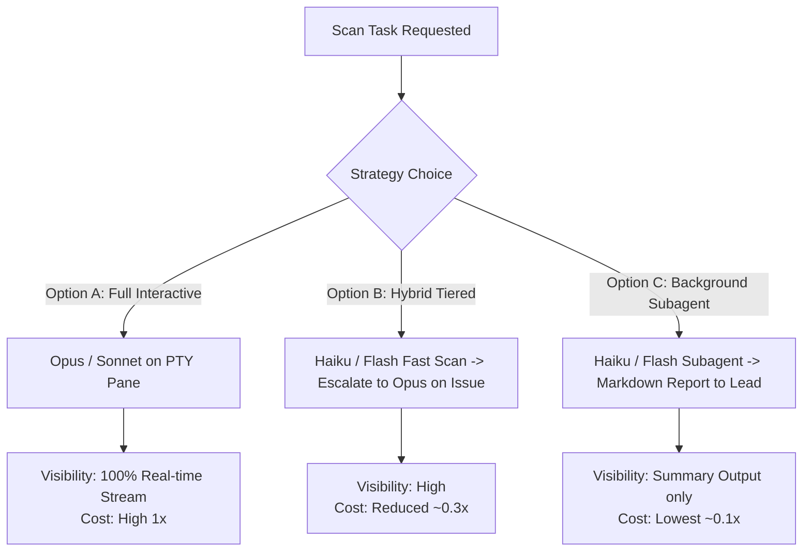

# แผน Token-Reduction Wave 2 + Backlog Prioritization (2026-07-24)

> **ผู้จัดทำ:** Gemini 3.6 Flash (1M Context Specialist)  
> **อ้างอิงข้อมูลจริง:** `docs/qa-reports/2026-07-24-token-audit.md` ( audit 7 วัน = 4.34B tokens, 98.25% cache reads ), `CHANGELOG.md` (1.0.29 Wave 1), และ GitHub Issues #124, #121, #123

---

## 1. บริบทและการประเมินผล Wave 1 (1.0.29)

ในเวอร์ชัน **1.0.29** ได้มีการ Ship ฟีเจอร์ลด Token ชุดแรกไปแล้ว:
- **`session_cap.py` Watchdog**: แจ้งเตือน edge-triggered เมื่อ prompt ทะลุ 180k tokens เพื่อให้ agent สรุปงานแล้ว `/compact`
- **One-shot Spawn Task Delivery**: ฝัง task เข้า `--append-system-prompt-file` ประหยัด ~60k tokens/spawn
- **Reasoning Effort Per Provider**: ควบคุม effort ตาม role tier

### ช่องว่าง (Gaps) ที่พบจาก Audit & Operations:
1. **Issue #124 (Gap ของ One-shot Delivery)**: ฟีเจอร์ประหยัด ~60k tokens/spawn ไม่ทำงานกับ Staggered Fan-out (เช่น `takkub assign --role backend --shards 3`) โดยตกไปใช้ `pointer` fallback ทั้งหมด
2. **Lead Inbox Noise (~5.1M tokens/7วัน)**: `done` notices และ `[CC]` messages ยิงตรงเข้า Lead ทีละข้อความ ทำให้ Lead ต้องตื่นมาอ่าน prompt เต็มบริบทซ้ำๆ
3. **Auto-reminder Trigger (~1.2M tokens/7วัน)**: การเตือน idle pane ผ่าน PTY write + ENTER ปลุก model turn ใหม่โดยไม่จำเป็น

---

## 2. ข้อเสนอทางเทคนิค (Technical Approach) สำหรับ Wave 2

### (a) Lead Inbox Digest (60s Window) & Non-turn Auto-reminders

#### 1. Lead Inbox Digest (`lead_inbox.py`)
- **ปัญหาเดิม**: ทุกครั้งที่ teammate ส่ง `takkub done` หรือ `takkub send --to <role> --cc lead`, `_pump_lead_notify()` จะส่งข้อความเข้า Lead PTY ทันทีถ้าระบบอยู่ที่ ready prompt ทำให้ Lead เกิด model turn ใหม่ทุกๆ Notice (3 done notices ใน 60 วินาที = 3 full-context re-reads)
- **แนวทางแก้ไขที่สอดคล้องกับ `LeadInboxMixin`**:
  - เพิ่ม **Digest Window (60 วินาที)** ใน `lead_inbox.py` (`_INBOX_DIGEST_WINDOW_MS = 60_000` / ปรับผ่าน `TAKKUB_INBOX_DIGEST_MS`)
  - เมื่อมี Notice เข้ามา ให้สะสมไว้ใน `_lead_notify_queue` และตั้ง debounced timer (`_digest_timer`)
  - เมื่อ Lead อยู่ที่ ready prompt และครบกำหนดเวลา (หรือเมื่อ Lead ว่าง) ให้รวบรวม Notice ทั้งหมดในคิวส่งเข้า Lead ใน **ข้อความเดียว (Single Turn)**
  - **รูปแบบ Digest**:
    ```text
    📬 [Lead Inbox Digest — 3 updates]
    • [backend#1] done: Refactored authentication middleware
    • [backend#2] done: Added unit tests for user API
    • [CC from frontend -> backend]: Updated API contracts
    ```
  - **ผลที่คาดว่าจะได้รับ**: ประหยัด ~5.1M tokens ใน 7 วัน โดยลดจำนวนครั้งที่ Lead ถูกปลุกโดยไม่จำเป็น

#### 2. Non-turn Auto-reminders (`orchestrator.py` & UI Status)
- **ปัญหาเดิม**: `_inject_idle_reminder()` ใน `orchestrator.py` ใช้ `_idle_sess.write(IDLE_REMINDER_TEXT)` ตามด้วย `_delayed_enter(150)` ซึ่งเป็นการกด Enter ส่ง prompt เข้า model turn
- **แนวทางแก้ไข**:
  - ปรับการแจ้งเตือนให้เป็น **Non-turn Triggering**:
    - **ทางเลือกหลัก (UI Badge/Header)**: อัปเดตสถานะบน UI Header / Tab Border ให้ขึ้นสถานะ `⚠️ Idle (รอ takkub done)` โดย **ไม่ยิง PTY Enter** เข้า process
    - **ทางเลือกสำรอง (PTY Text buffer without submission)**: หากต้องการให้เห็นใน terminal log ให้ write ข้อความเข้า buffer โดย **ไม่เรียก `_delayed_enter`** เพื่อไม่ให้เกิดการกดส่งสร้าง model turn ใหม่
  - **ผลที่คาดว่าจะได้รับ**: ประหยัด ~1.2M tokens ใน 7 วัน และไม่รบกวน agent ที่กำลังประมวลผลหรือรอผลลัพธ์

---

### (b) แก้ไข Issue #124: One-shot Spawn Task Delivery บน Staggered Fan-out

- **สาเหตุของปัญหา (Root Cause Analysis)**:
  - เมื่อยิง `takkub assign` แบบหลาย shard หรือหลาย role ติดกัน `cli_server.py` จะตั้ง `QTimer.singleShot(delay)` เพื่อ stagger การ spawn (เช่น +0ms, +9266ms, +19266ms)
  - Pane ที่ 2 และ 3 จะถูกเรียก `spawn()` ในขณะที่ `_spawn_in_progress` หรือ spawn gate ทำงานอยู่ ทำให้ `spawn()` เลื่อนการทำงาน (returns `spawn deferred` / `spawn queued`)
  - แม้ `spawn_initial_task_state` จะถูกเปลี่ยนเป็น `"pending"` ในรอบแรก แต่เมื่อรอบ retry/queue-drain ทำงานจริง State หรือ Task File Reference บางส่วนหลุดหรือถอยกลับไปใช้ Pointer Delivery ทำให้ log บันทึกเป็น `initial_delivery: 'pointer'`
- **แนวทางแก้ไข (Fix Approach)**:
  1. **Durable Task Payload Persistence**: ปรับให้ `spawn_initial_task` และ `spawn_initial_prompt_file` ผูกอยู่กับ `pane_state` อย่างถาวรจนกว่า session ของ pane นั้นจะสร้างเสร็จสมบูรณ์ (`_finish_spawn_initial_task`)
  2. **Preserve Pending State in Retry Path**: ใน `_retry_deferred_spawn` และ `_drain_spawn_queue` ของ `spawn_engine.py` ให้ตรวจสอบและคงสถานะ `spawn_initial_task_state = "pending"` ไว้เสมอ เพื่อให้ `_prepare_spawn_system_prompt()` ดึง task ไปใส่ใน `--append-system-prompt-file` ได้สำเร็จเมื่อ process ถูก launch จริง
  3. **Integration Test Support**: เขียน Integration Test สำหรับ Staggered Fan-out (ทดสอบ spawn 3 panes พร้อม delay) เพื่อยืนยันว่าทุก pane เกิด event `spawn_initial_task_preloaded` ทั้งหมด

---

## 3. การจัดลำดับความสำคัญ Backlog (Prioritization Matrix)

| อันดับ | Issue / Feature | ผลกระทบ (Impact) | Effort | ความเสี่ยง | คำอธิบาย & เหตุผล |
|:---:|---|---|:---:|:---:|---|
| **1** | **#124 Fix One-shot Staggered Delivery** | **สูงมาก** (~17.9M tokens/7วัน) | Low-Med | ต่ำ | ปิด gap ของ 1.0.29 ทำให้การประหยัด ~60k/spawn ทำงานกับ fan-out ทุกเคส |
| **2** | **Lead Inbox Digest (60s)** | **สูง** (~5.1M tokens/7วัน) | Med | ต่ำ-กลาง | ลดการปลุก Lead ซ้ำซ้อน ช่วยให้ Lead session ไม่บวมเร็วจนเกินไป |
| **3** | **#121 Fix Codex Pane MCP Hang** | **กลาง-สูง** (แก้ pane ค้าง 11 นาที) | Low | ต่ำ | บังคับใช้ `pane_tools_policy` บน Codex provider ป้องกันการโหลด MCP หนักโดยไม่จำเป็น |
| **4** | **Non-turn Auto-reminders** | **กลาง** (~1.2M tokens/7วัน) | Low | ต่ำ | เปลี่ยน idle reminder เป็น UI notification / non-submitting buffer |
| **5** | **#123 Windows Native Chrome & Mini-browser** | **กลาง** (ความเสถียรของ QA) | Med | กลาง | แก้ปัญหา screenshot บน Windows ทุก provider และ sync `$TAKKUB_ARTIFACTS_DIR` ของ Gemini |

---

## 4. กลยุทธ์ Subagent & Model Selection สำหรับ Scan-Heavy Roles

สำหรับบทบาทที่มีการอ่านไฟล์/สแกนโค้ดจำนวนมาก (Scan-Heavy Roles) เช่น `critic`, `qa`, `reviewer`, `docs_verify`:

### การวิเคราะห์ Trade-off: Visibility vs Cost



### ข้อเสนอทางเลือกให้ User พิจารณา (User Choice Options):

1. **Option A: High Reasoning & Full Real-time Visibility (Default เดิม)**
   - ใช้ Sonnet/Opus บน PTY Pane แบบ Interactive เต็มรูปแบบ
   - *ข้อดี*: เห็นการทำงานแบบ Real-time บน terminal grid สั่งงานแทรกได้ทันที
   - *ข้อเสีย*: ค่า Token สูงสุดสำหรับงานสแกนเอกสาร/โค้ดขนาดใหญ่

2. **Option B: Hybrid Tiered Scanning (แนะนำ - Recommended)**
   - ใช้ Haiku 4.5 / Gemini Flash ในการสแกนรอบแรก (First Pass Audit/Scan)
   - ยกระดับเป็น Opus/Sonnet เฉพาะเมื่อพบข้อผิดพลาดที่ต้องใช้การวิเคราะห์เชิงลึก หรือเมื่อถึงขั้นตอน Final Gate Signoff
   - *ข้อดี*: ประหยัดค่า Token ได้ 60-70% โดยไม่สูญเสียความแม่นยำในการตัดสินใจขั้นสุดท้าย

3. **Option C: Subagent / Background Report Generation**
   - รันงานสแกนผ่าน Background Subagent (ใช้ Haiku/Flash) แล้วสรุปผลลัพธ์เป็น Markdown Report ลงใน `docs/` ส่งให้ Lead อ่านแบบ Digest
   - *ข้อดี*: ประหยัด Token และ Context Space ของ Lead สูงสุด (>80%)
   - *ข้อเสีย*: ไม่เห็น terminal stream ระหว่างสแกน ต้องอ่านสรุปจากไฟล์รายงาน

---

## 5. แผนการดำเนินงาน (Implementation Plan Roadmap)

1. **Phase 2.1 (Immediate - Wave 2 Core Fixes)**:
   - แก้ไข **#124** (`spawn_engine.py` & `orchestrator.py` task payload persistence) + Integration Test
   - แก้ไข **#121** (บังคับ `pane_tools_policy` บน Codex provider)
2. **Phase 2.2 (Token & Traffic Optimization)**:
   - อัปเดต `LeadInboxMixin` เพิ่ม **60s Digest Batching**
   - ปรับ `_inject_idle_reminder` เป็น Non-turn UI Notification
3. **Phase 2.3 (QA & Tooling Enhancement)**:
   - ดำเนินการแก้ไข **#123** (Windows Native Chrome launch & Gemini artifacts dir sync)
