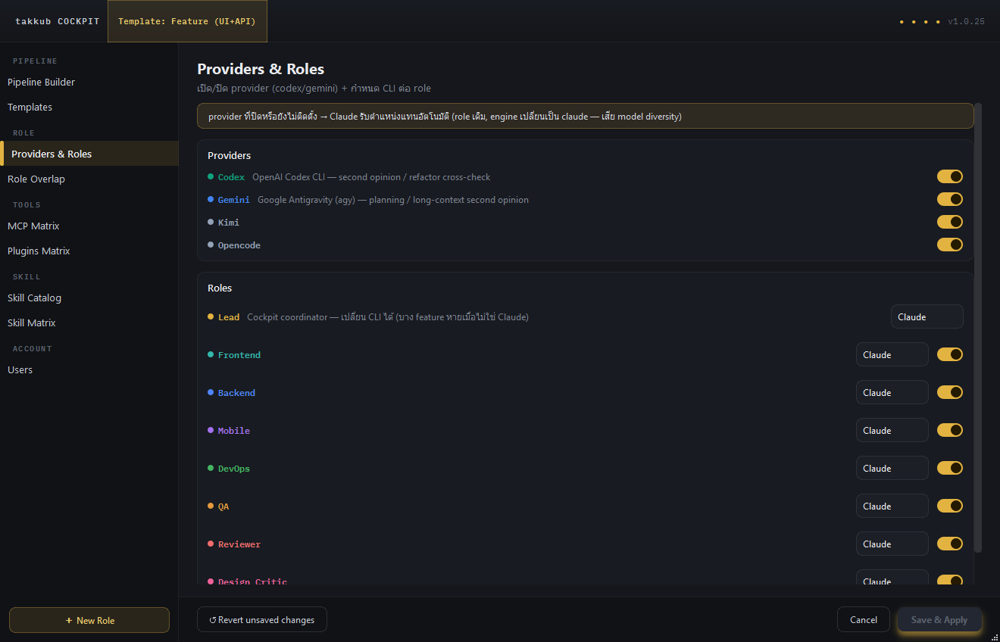

# QA Report: Provider Chip Removal & Kimi Provider Smoke Test (2026-07-20)

## 1. Status Bar Check
- **Objective:** Verify that `● Codex`, `● Gemini`, and `● OpenCode` chips are no longer present in the status bar (formerly in subgroup 2b).
- **Result:** **PASS**. The status bar renders correctly. The chips are absent. Only the execution mode, auto-resume, remote, rtk install, restart, pipelines, and update buttons are visible in the right-side permanent widget area.
- **Screenshot:**
  

## 2. Settings Team Panel
- **Objective:** Verify that the provider list in Settings → 👥 Team panel shows all 4 providers: `codex`, `gemini`, `opencode`, and `kimi`.
- **Result:** **PASS**. The panel successfully lists all 4 providers. Toggles are present and functional.
- **Screenshot:**
  

## 3. Kimi Provider Toggle & Persistence
- **Objective:** Toggle the `kimi` provider and verify persistence to `~/.takkub/disabled-providers.json`.
- **Result:** **PASS**.
  - Initial state in JSON: `{"codex": false, "gemini": false}`
  - After disabling Kimi: `{"codex": false, "gemini": false, "kimi": true}`
  - After restoring (enabling) Kimi: `{"codex": false, "gemini": false, "kimi": false}`

## 4. Console Logs / Exceptions
- **Objective:** Check for exceptions or tracebacks during app launch caused by the chip removal or the addition of Kimi.
- **Result:** **PASS**. No exceptions or `AttributeError`/`KeyError` occurred during `MainWindow` initialization, status bar building, or Settings Window interactions.
