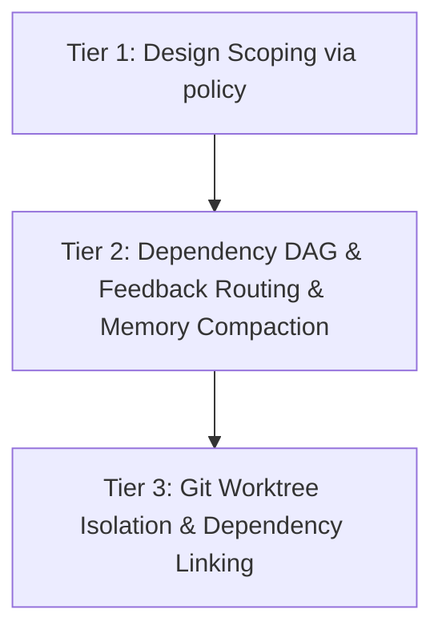

# Critical Cross-Check: Agent-Takkub Multi-Agent Integration Plan

This document evaluates the proposed plan to integrate architecture patterns and skills from four external repositories (`pro-workflow`, `ui-ux-pro-max-skill`, `agent-orchestrator`, and `AgentSkillOS`) into `agent-takkub`.

---

## 1. Analysis of Tier 2: Worktree Isolation & Self-Correction Memory

### A. Git Worktree Isolation
* **The "Token ~0" Illusion:** While it is true that Git Worktrees do not directly increase LLM context tokens (they are a Git-level mechanism), the indirect token cost of **merge conflict resolution** is extremely high. If $K$ parallel agents work on overlapping files, merging back requires the Lead or a Critic agent to parse diffs, resolve conflicts, and re-run tests. This consumes substantial token context.
* **Non-Git workspaces:** If `agent-takkub` is opened in a non-git directory or a dirty repository, worktrees cannot be created. The system must fallback to directory cloning, which is slow and disk-heavy.
* **Windows Node Modules & Caches:** Spawning a worktree does not automatically link gitignored files like `node_modules` or `.env` files. Copying `node_modules` on Windows is extremely slow due to the NTFS file system. Running `npm install` or `uv sync` on every worktree initialization is time-prohibitive.
* **Invisible execution:** Users working in a GUI cockpit (or standard IDE pointing to the main project directory) will not see real-time updates of files modified inside the hidden worktree directories. This hurts observability.

### B. Self-Correction Memory
* **Context Accumulation Bloat:** Appending every single user correction as a rule into a project-specific memory means the context window scales linearly over time. Every new pane spawned will load this growing file, causing a permanent token penalty on every prompt.
* **Rule Contradiction & Hallucination:** Raw appends lead to conflicting rules (e.g., "Always use X" followed by "Do not use X for Y"). LLMs struggle with conflicting system prompts, leading to loops, tool failures, and massive token waste.

---

## 2. Evaluation of Excluded Items & Feedback Routing

* **Correctly Dropped:**
  * **Electron Rewrite / SQLite CDC / Visual Canvas:** These would bloat the current lightweight Python/PyQt architecture.
  * **AgentSkillOS 200K Skill-Tree:** Vector-retrieving from a massive skill-tree consumes high latency and unnecessary tokens.
* **Incorrectly Delayed / Should be Promoted:**
  * **Feedback Routing (CI-Fail / Merge Conflict auto-fix):** Currently placed in Tier 3. However, without automated routing of test and conflict feedback back to the specific offending pane, parallel execution (Tier 2a) is unusable. The cockpit would halt on every small test failure, requiring constant manual intervention.
  * **AgentSkillOS DAG-Strategy:** While we do not need the 200K skills, a **lightweight Directed Acyclic Graph (DAG) task dependency planner** is critical. If frontend features depend on backend API schemas, running them simultaneously in parallel worktrees without dependency awareness will result in immediate compilation or API integration failures.

---

## 3. Tier Re-ordering & ROI Optimization

We recommend the following reorganization to maximize ROI and avoid high upfront complexity:

| Tier | Component | Description | ROI / Effort |
| :--- | :--- | :--- | :--- |
| **Tier 1** | **Design Skill Scoping** | Route `ui-ux-pro-max` specifically to `designer`/`critic` via `pane-tools` policy. | **High ROI / Low Effort** (Already supported by [pane_tools_policy.py](file:///C:/Users/monch/WebstormProjects/agent-takkub/src/agent_takkub/pane_tools_policy.py)). |
| **Tier 2** | **Memory Compaction & Deduplication** | Instead of raw appends, implement an automated summarization step for user rules to prevent context bloat. | **High ROI / Medium Effort** |
| **Tier 2** | **Feedback Routing (CI / Conflict)** | Basic routing to send compiler/test errors back to the spawning pane. | **High ROI / Medium Effort** |
| **Tier 2** | **Lightweight DAG Routing** | Update [routing_planner.py](file:///C:/Users/monch/WebstormProjects/agent-takkub/src/agent_takkub/routing_planner.py) to sequence frontend/backend tasks if dependency exists. | **High ROI / Medium Effort** |
| **Tier 3** | **Git Worktree Isolation** | Full worktree isolation with NTFS hardlink/symlink sharing for `node_modules`. | **Medium ROI / Very High Effort** (Window lock issues). |

---

## 4. Critical Blind Spots (Not addressed by Lead)

1. **Windows File Locks (`PermissionError`):**
   * On Windows, running dev servers or tests holds active file handles on `node_modules` or compiled artifacts. Any attempt by Git or the orchestrator to merge, prune, or switch branches in a worktree will crash due to locked files.
2. **API Rate Limits (RPM / TPM):**
   * Running 4 parallel `claude` instances concurrently will quickly saturate LLM provider rate limits (especially with Claude Code's large context windows). The cockpit needs a centralized token rate-limiter or queue.
3. **Environment and Secrets Propagation:**
   * Gitignored files like `.env`, local configs, or database credentials do not propagate to new worktrees. Parallel agents will crash on boot because they lack local environment setup.
4. **Tool and Path Routing:**
   * MCP tools executed by teammates must resolve paths relative to their isolated worktree, not the main project root, requiring careful isolation of the workspace environment in [spawn_engine.py](file:///C:/Users/monch/WebstormProjects/agent-takkub/src/agent_takkub/spawn_engine.py).
