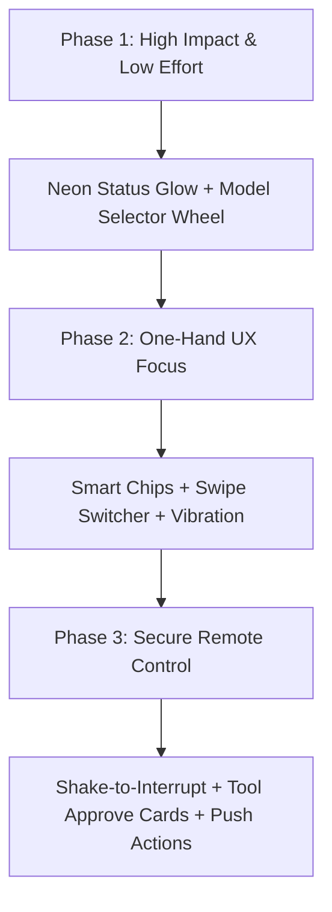

# Brainstorm: Takkub Mobile Remote PWA Feature Ideas

This document presents a curated, ranked list of **13 feature ideas** for the **Takkub Mobile Remote PWA** with a primary focus on UX, delight, glanceability, one-hand usability, security, and alignment with the data-minimized and bolt-on principles.

---

## Executive Overview & Themes

To deliver a "beautiful, easy, and cool" (สวยๆ ใช้ง่ายๆ แจ่มๆ) experience for an operator on the move, these ideas focus on:
1. **Glanceability**: Knowing the exact status of the Lead at a single look from across the room.
2. **Tactile Delight**: Feeling and interacting with the UI naturally with one hand.
3. **Safe Remote Control**: Providing peace of mind when allowing autonomous actions from a phone.
4. **Bolt-on Friendly**: Ensuring all features require minimal backend footprint and can be cleaned up without trace when deleted.

---

## Feature Matrix

| Rank | Feature Name | Primary Benefit | Effort | Data-Min / Bolt-on Friendly |
| :--- | :--- | :--- | :---: | :---: |
| 1 | **1. Tactile Model Selector Wheel** | Control & Delight | **S** | Yes (Client-only toggle) |
| 2 | **2. Neon Aura Status Glow** | Glanceability | **S** | Yes (CSS animation + state) |
| 3 | **3. Contextual Smart Action Chips** | One-hand UX | **M** | Yes (Client parsing) |
| 4 | **4. "Shake-to-Interrupt" Emergency Stop** | Secure Control & Peace-of-Mind | **S** | Yes (Browser Sensor API) |
| 5 | **5. Web Push Notification with Direct Actions** | Peace-of-Mind | **L** | Medium (Requires push service) |
| 6 | **6. "Peek & Approve" Tool Cards** | Control & Data-Min | **M** | Yes (Standard SSE/JSON payload) |
| 7 | **7. Tactile Haptic Vibration Cues** | Delight & Glanceability | **S** | Yes (Browser Vibration API) |
| 8 | **8. Voice-to-Command Microphone** | One-hand UX | **M** | Yes (Built-in Speech API) |
| 9 | **9. Offline Cache & Gray-out State** | Peace-of-Mind | **M** | Yes (IndexedDB storage) |
| 10 | **10. Top-edge Task Progress & Step Tracker** | Glanceability | **M** | Yes (Lightweight stage metadata) |
| 11 | **11. Biometric Session Guard (FaceID/PIN)** | Secure Control | **M** | Yes (Local WebAuthn/localStorage) |
| 12 | **12. Micro-Summary Widget Drawer** | Glanceability & Control | **M** | Yes (Aggregated metrics only) |
| 13 | **13. Quick Swipe Project Switcher** | One-hand UX | **S** | Yes (Client UI event handler) |

---

## Detailed Feature Breakdown

### 1. Tactile Model Selector Wheel
* **What it does**: A tactile, sliding dial or wheel interface at the top/bottom bar of the PWA that lets the user switch the active LLM model (e.g., Claude 3.5 Sonnet, Claude 3 Opus, Claude 3.5 Haiku, Fable, etc.) for the project.
* **Why it's useful**: **Tactile Control & Delight**. It provides direct control over the AI engine from the phone. Tapping or sliding the dial updates the model config immediately, accompanied by a subtle satisfying visual rotation and haptic snap.
* **Effort**: **S** (UI selector updating backend model state parameter).
* **Data-min / Bolt-on compatibility**: **High**. It's just a config toggle. No heavy data overhead, fits seamlessly with the minimized style.

---

### 2. Neon Aura Status Glow
* **What it does**: Turns the outer border of the mobile viewport, or the PWA top header, into a soft, glowing ambient gradient (glow-ring) that pulses slowly depending on the Lead's state:
  * **Blue Glow**: Thinking / Tool executions (active).
  * **Amber Pulse**: Blocked / Waiting for user approval/interaction.
  * **Green Fade**: Successful completion / Idle.
  * **Red Pulse**: High-risk error / Cancelled.
* **Why it's useful**: **Glanceability**. The user can place their phone on the kitchen counter or desk and instantly know the status of the background task by looking at the glow pattern, without reading any text.
* **Effort**: **S** (CSS box-shadow / border animation driven by SSE status events).
* **Data-min / Bolt-on compatibility**: **High**. Entirely front-end styling. Zero database footprint.

---

### 3. Contextual Smart Action Chips
* **What it does**: Renders 2–3 contextual action buttons (chips) floating right above the input composer. These chips dynamically change based on the current context:
  * If Lead is running a long test: `[Force Stop]`, `[Show output preview]`, `[Pause]`.
  * If Lead asks for feedback: `[Approve]`, `[Reject]`, `[Rewrite plan]`.
  * If Lead is idle: `[Run tests]`, `[Check git status]`, `[Generate commit proposal]`.
* **Why it's useful**: **One-hand UX**. Saves the user from typing full instructions/commands on a cramped mobile keyboard. A single thumb tap drives the conversation.
* **Effort**: **M** (Requires client-side parsing of the Lead's current request type or state to supply matching chips).
* **Data-min / Bolt-on compatibility**: **High**. Uses the existing active message data stream.

---

### 4. "Shake-to-Interrupt" Emergency Stop
* **What it does**: Physically shaking the phone triggers an instant interrupt/abort command (`takkub cancel` / `/stop`) to the active Lead task. When triggered, the phone vibrates intensely, displays a full-screen confirmation overlay, and immediately signals the backend to kill the current run.
* **Why it's useful**: **Secure Control & Peace-of-Mind**. If the user is on the go and notices the agent doing something unintended or expensive in the log, they can cancel it instantly in a panic situation without needing to tap small buttons.
* **Effort**: **S** (Uses the standard browser `DeviceMotionEvent` API).
* **Data-min / Bolt-on compatibility**: **High**. No data storage needed. Clean client-side event.

---

### 5. Web Push Notification with Direct Actions
* **What it does**: Uses the Web Push API to send real-time system notifications to the phone when the PWA is closed. Notifications are triggered on key events:
  * *Lead needs approval* -> Notification has interactive action buttons: `[Approve]` and `[Reject]` right on the lockscreen.
  * *Task Completed / Failed*.
* **Why it's useful**: **Peace-of-Mind & Glanceability**. The user does not need to keep the browser open or check it repeatedly; the phone alerts them precisely when action is required.
* **Effort**: **L** (Requires setting up service workers, push server subscription endpoint, and VAPID key storage).
* **Data-min / Bolt-on compatibility**: **Medium**. The backend needs to track subscription endpoints. However, because it is bolt-on, when the PWA is "uninstalled" or the browser clears site data, the subscriptions are dropped and can be wiped from the server database without side effects.

---

### 6. "Peek & Approve" Tool Cards
* **What it does**: Keeps the main chat feed exceptionally clean (data-minimized) by folding complex tool actions into small, neat cards (e.g., `🔧 run_command: pytest`). Tapping the card expands it with a beautiful dark terminal code block showing the script/command, exposing large, friendly `[Green Check]` / `[Red X]` buttons for approvals.
* **Why it's useful**: **Control & Data-Min**. Restricts verbose command logs to a single tap, keeping the conversation readable while maintaining strict control over what runs on the developer's PC.
* **Effort**: **M** (Formatting tool events in the message parser).
* **Data-min / Bolt-on compatibility**: **High**. Keeps payload minimal until expanded.

---

### 7. Tactile Haptic Vibration Cues
* **What it does**: Uses the browser's vibration motor to communicate background state changes in the pocket or hand:
  * `Short dual pulse (..)`: Task succeeded!
  * `Long single vibration (_)`: Agent is blocked / Waiting for human intervention.
  * `Short tick (.)`: Command sent / button tapped.
* **Why it's useful**: **Delight & Glanceability (Tactile)**. Allows the user to sense progress and alert states without even looking at the screen.
* **Effort**: **S** (Uses `window.navigator.vibrate` API).
* **Data-min / Bolt-on compatibility**: **High**. Local browser feature only.

---

### 8. Voice-to-Command Microphone
* **What it does**: Adds a microphone icon inside the text composer. Holding the mic records the user's voice and utilizes the local browser-native Web Speech API (speech-to-text) to translate speech directly into text in the input box, allowing review before sending.
* **Why it's useful**: **One-hand UX & Delight**. Perfect for instructing the agent while walking or when typing on a virtual keyboard is inconvenient.
* **Effort**: **M** (Utilizes local native browser transcription without third-party server cost or latency).
* **Data-min / Bolt-on compatibility**: **High**. Zero dependencies or remote server logs.

---

### 9. Offline Cache & Gray-out State
* **What it does**: Stores the session history (up to 200 lines) locally using browser IndexedDB / LocalStorage. When the mobile device goes offline (e.g. entering an elevator):
  * The existing log is grayed out to signal offline status.
  * An offline banner appears.
  * Once connection is restored, it fetches only the delta since the last known sequence ID and returns to full color.
* **Why it's useful**: **Peace-of-Mind & UX**. Prevents the screen from wiping clean or failing to load when network switches.
* **Effort**: **M** (Client-side sync logic using LocalStorage offsets).
* **Data-min / Bolt-on compatibility**: **High**. Zero server state; all data is local to the phone and deleted when browser data is cleared.

---

### 10. Top-edge Task Progress & Step Tracker
* **What it does**: Displays a thin, glowing multi-segment progress line at the top of the interface. Each segment represents a stage in the Lead's current execution plan (e.g., `Plan [1/4] -> Research -> Edit -> Test -> Done`). Tapping it displays a quick tool tip of what task is running.
* **Why it's useful**: **Glanceability**. Instantly conveys how far the Lead is along its execution loop without scrolling or reading logs.
* **Effort**: **M** (Requires the server to parse/emit the step progression index from the Lead's system state).
* **Data-min / Bolt-on compatibility**: **High**. Exposes only summary integers and brief titles.

---

### 11. Biometric Session Guard (FaceID/PIN)
* **What it does**: Adds an optional biometric screen lock (FaceID/TouchID via WebAuthn API or a fast 4-digit PIN) that locks the remote session after 2 minutes of idle time.
* **Why it's useful**: **Secure Control**. Prevents anyone else from grabbing the user's unlocked phone and executing destructive commands on the developer's workstation.
* **Effort**: **M** (Utilizes standard browser credentials / simple passcode overlay).
* **Data-min / Bolt-on compatibility**: **High**. Stored locally on the mobile client.

---

### 12. Micro-Summary Widget Drawer
* **What it does**: A collapsible drawer at the top of the chat showing high-level stats of the current project run:
  * **Estimated Cost**: USD spent in the session.
  * **Token usage meter** (in-memory estimate).
  * **Affected Files**: Count of files currently changed.
* **Why it's useful**: **Glanceability & Control**. Keeps the developer aware of billing and impact scope at a glance, without checking the command console.
* **Effort**: **M** (Aggregates session totals in the SSE backend broadcaster).
* **Data-min / Bolt-on compatibility**: **High**. Highly minimized metrics payload.

---

### 13. Quick Swipe Project Switcher
* **What it does**: Allows the user to swipe left/right on the top navigation bar containing the project name to quickly cycle through open, active projects. Swiping triggers a smooth slide transition animation and updates the chat log to the selected project.
* **Why it's useful**: **One-hand UX**. Avoids having to open a dropdown or switch views to see how other tasks are doing.
* **Effort**: **S** (Simple touch handler binding to the existing `selectProject` function).
* **Data-min / Bolt-on compatibility**: **High**. Uses the client side switching mechanism.

---

## Action Plan & Roadmap Recommendation

1. **Quick Wins (Phase 1)**: Implement **Model Selector Wheel** (User priority) and **Neon Status Glow**. Both take hours to build and immediately transform the PWA's polish.
2. **UX Expansion (Phase 2)**: Add **Contextual Smart Chips** and **Tactile Haptic Feedback** to reduce physical mobile typing and increase tactile delight.
3. **Advanced Integration (Phase 3)**: Introduce **Web Push Notifications with Lockscreen Action Buttons** for the ultimate "peace of mind" experience away from the desk.
