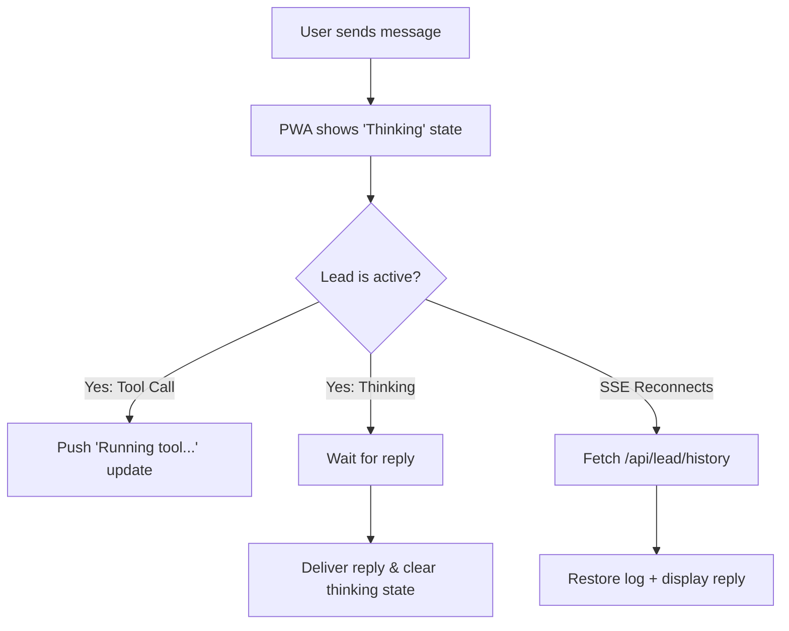

# Review: Mobile Remote Reply UX & Timing Edge Cases

This document details a design review of the communication pipeline between the desktop cockpit orchestrator and the mobile Remote PWA, specifically focusing on the problem of the user perceiving that the Lead is not responding (even though the underlying system and pipelines are functionally verified and working).

---

## Executive Summary

While the live proof shows that the end-to-end pipeline (appending a JSONL record $\rightarrow$ `notify.py` polling $\rightarrow$ SSE broadcasting $\rightarrow$ PWA rendering) works, real-world usage introduces timing and state synchronization issues. These issues lead users to believe that the connection is dead, the message was lost, or the Lead is ignoring them.

We identified **four key scenarios** where the pipeline is "correct" but the user perception is broken, along with recommended fixes.

---

## Detailed Scenarios

### Scenario 1: Long Thinking Turns (No Typing/Thinking Indicator)
* **Severity**: **High**
* **Mechanism**:
  1. The user types a command on their phone and clicks "Send".
  2. The PWA appends the user's bubble (`me`) to the chat log and sends a POST to `/api/lead/say`.
  3. The message is successfully routed to the Lead pane, which begins processing (thinking, running commands, calling tools). This process can take anywhere from 10 seconds to several minutes.
  4. During this entire time, the mobile PWA remains completely static. There is no spinner, no typing bubble, and no status indication showing that the Lead is active.
* **User Perception**: The user assumes the message was dropped, the connection failed, or the backend is stuck. They may repeatedly resend the message, refresh the page, or close the app.
* **Suggested Fix**:
  * **Frontend (app.js)**: Immediately upon sending a message, transition the composer/chat UI to a "thinking" state. Append a transient typing indicator (e.g., `Lead กำลังคิด...` with a subtle pulsing animation) at the bottom.
  * **Event Handling**: Remove this typing indicator only when the next SSE `lead` event or a status change is received.

---

### Scenario 2: Message Loss during the Reconnection Gap
* **Severity**: **Critical** (Silent Data Loss)
* **Mechanism**:
  1. The mobile client experiences a brief connection drop (e.g., switching from Wi-Fi to cellular, screen sleep/wake). The browser's `EventSource` connection is closed, and the client enters its retry loop.
  2. During this reconnect window (which takes 1 to 15 seconds), the Lead finishes its turn and writes the reply to the `.jsonl` file.
  3. `notify.py` polls the file, reads the new line, and pushes it to `SSEBroadcaster`.
  4. In `http_server.py`, the `SSEBroadcaster` iterates through its active client list. Since the client is temporarily disconnected, there are zero active SSE client queues registered for that project namespace. The message is discarded.
  5. The tail offset in `notify.py` is advanced to the end of the file.
  6. The client successfully reconnects and registers a new queue, but the broadcaster starts tailing from the new offset.
* **User Perception**: The reply is never displayed. The user waits indefinitely for a response that was sent and discarded.
* **Suggested Fix**:
  * **Broadcaster-side Buffering**: Modify `SSEBroadcaster` to keep a small in-memory ring buffer (e.g., the last 10 messages) per project namespace. When a new SSE client connects, replay the contents of the buffer first.
  * **Or, History-based Recovery**: Upon connection (or reconnection), let the client fetch the latest messages from the session log (see Scenario 3).

---

### Scenario 3: Cleared Console History on Reload or Project Switch
* **Severity**: **High**
* **Mechanism**:
  1. In `app.js`, when a project is selected (either at startup or via `selectProject`):
     ```javascript
     function selectProject(name) {
       ...
       var log = $("lead-log");
       if (log) log.innerHTML = ""; // Clears the entire chat UI!
       stopLeadStream();
       switchView("lead");
       ...
     ```
  2. The client establishes a new SSE connection, starting with an empty console screen.
  3. The remote API does not provide any endpoint to query the historical chat logs of the current session.
* **User Perception**:
  * If the user reloads the PWA or if the browser reclaims memory and reloads in the background, their entire conversation history is wiped.
  * If they switch to the "Projects" tab or to another project to check on status, and then switch back to the main project, the previous chat history is gone. They see a blank screen with "ยังไม่มีข้อความ" (No messages), losing all context of the ongoing task.
* **Suggested Fix**:
  * **History API**: Add a `/api/lead/history?project=<project_ns>` endpoint that parses the current `.jsonl` file on the desktop and returns the last $N$ lines of chat history.
  * **Frontend Integration**: On connection or project switch, before opening the SSE stream, call this API to populate the `lead-log` with the session's history.

---

### Scenario 4: Total Silence During Tool/Thinking Executions
* **Severity**: **Medium**
* **Mechanism**:
  1. `notify.py` only extracts text blocks from `type == "assistant"` records.
  2. It explicitly ignores `thinking`, `tool_use`, and `tool_result` events in `_lead_text_blocks`.
  3. For long-running, multi-step agent actions (such as running a build or executing tests), the JSONL is updated with tool runs, but the mobile user receives absolutely no feedback until the final text reply is written.
* **User Perception**: Prolonged silence makes the remote control feel slow and disconnected compared to the desktop cockpit, where the user can see tool commands running in real-time.
* **Suggested Fix**:
  * **Send Tool Start Signals**: While we don't want to stream the raw stdout/PTY junk (to prevent mobile UI lag and CPU churn), we can emit lightweight progress markers.
  * **Notify on Tool Use**: When `notify.py` sees a JSONL record with `tool_use`, it could push a lightweight status update like `[System: Running tool <name>...]` to the PWA, showing the user that progress is active and ongoing.

---

## Action Plan (UX Recommendation)



1. **Implement `/api/lead/history`**:
   Expose an endpoint on the backend that reads the active Lead session's `.jsonl` file and outputs the recent message history.
2. **Populate History on Load/Reconnect**:
   Modify `app.js` to call the history endpoint whenever it opens the Lead view, eliminating the blank screen problem.
3. **Add Thinking Indicator**:
   Show a typing bubble under the user's last message as long as the Lead has not responded.
4. **Leverage the Pulse Endpoint**:
   Render a small pulsing indicator on the header next to the project title in the PWA when the background poll detects that `working > 0`.
